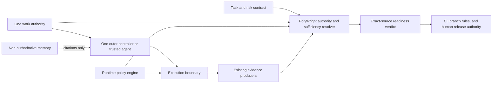

# 28 - Current Agent Ecosystem And PolyWright Decision Study

Date: 2026-07-13

Status: complete for the bounded ecosystem, source-screening, crosswalk and
next-step decision defined here. It is deliberately not architecture-, product-
or adoption-ready: repeated same-task outcome superiority, hostile/recovery
trials and production isolation assurance remain unproven. See section 20.

Purpose: establish the current agent-tool ecosystem from a clean epistemic
slate, verify the capabilities and limits that matter to PolyWright, compare
credible alternatives under multiple usage scenarios, and decide what to
adopt, bridge, contribute to, build, defer, watch, or reject.

Earlier PolyWright research, awesome-list descriptions, project READMEs, vendor
benchmarks, popularity signals, and prior recommendations were treated as
discovery inputs, not inherited facts.

## Executive Decision

The clean-slate review changes the direction.

1. The ecosystem is much larger and more capable than the repository's prior
   quick catalogs suggested. After current-source enrichment and three verified
   transfer merges, the machine ledger has 570 canonical entities. It retains
   2,730 provenance-bearing claims and 48 aliases. All 562 accessible entities
   were primary-source screened, eight remained not found, and every eligible non-
   list entity received a bounded static source-tree screen.
2. Generic orchestration, cockpits, trackers, runtimes, sandboxes, policy
   engines, receipts, evidence bundles, scanners, memory, and company control
   planes are already crowded. PolyWright should not rebuild them.
3. The simple baseline—one trusted agent, current tracker/Git, deterministic
   checks, exact-SHA CI, human merge/release—remains the default for solo,
   low-cost, and security-sensitive work until measured trials beat it.
4. None of the orchestrators or governance overlays evaluated here qualifies,
   on the evidence gathered, for hostile-code or regulated production use.
5. The defensible PolyWright residual **hypothesis** is a narrow,
   vendor-neutral readiness and conformance layer: authority resolution,
   portable task/risk contract,
   capability/adapters, normalized evidence, non-vacuous sufficiency,
   cumulative run risk, exact-source verdict, and a comparative red-team
   harness.
6. The neutral format crosswalk and 20-case adversarial fixture now exist, and
   the first proof-gate wave ran Runcap plus dxkit in fresh offline Windows
   Sandbox guests. It exposed a Runcap docs/code path mismatch, confirmed its
   clean-base and human-verdict semantics, and confirmed dxkit's default versus
   full-debt behavior. It did **not** expose the same unresolved product need
   across two heterogeneous tools. Do not freeze or build a PolyWright product
   schema. Continue a comparator only when a real scenario can supply the
   missing outcome, bypass, recovery or substrate evidence.

Windows Sandbox produced E5 build/test evidence for OpenLeash, Starfish,
Runcap and dxkit under two-stage online-acquisition/offline-execution protocols.
Inputs were read-only, results narrowly writable, no credentials were mapped,
network probes failed offline, and resource telemetry was retained. Escape
resistance, production isolation assurance and software-outcome superiority
were not tested, so the report makes no hands-on adoption claim.

## 1. Research Questions

This study must answer:

1. What problem does each candidate actually solve, for which user, task, and
   operating environment?
2. Which authority layer does it own or attempt to own?
3. Which capabilities are implemented and usable, which are vendor-reported,
   and which are only implied?
4. Which candidates compete, compose, conflict, mirror, or duplicate state?
5. What are the setup, operation, migration, maintenance, and exit costs?
6. What permissions and authority can each candidate exercise?
7. What evidence, verification, audit, and enforcement does it provide?
8. How does it fail, recover, resume, preserve state, and contain damage?
9. How secure, private, portable, maintainable, and legally reusable is it?
10. Does it improve software outcomes relative to a simpler baseline after
    quality, cost, latency, and human attention are counted?
11. After composing the strongest current tools, what valuable responsibility
    remains unowned?
12. Is that residual responsibility sufficient to justify PolyWright, and if
    so, what is the smallest defensible PolyWright product?

## 2. Usage Scenarios

There is no universal winner. Decisions will be made separately for:

1. An expert solo maintainer using one coding agent.
2. A small team using one shared coding-agent workflow.
3. A paired implementer and independent reviewer.
4. A visible multi-agent cockpit with human supervision.
5. A terminal/worktree-oriented swarm.
6. Long-running autonomous or scheduled work.
7. Hostile or untrusted code execution requiring containment.
8. A regulated, privacy-sensitive, or data-residency-constrained repository.
9. A local, private, or offline deployment.
10. Low-cost, weak-model, or local-model operation.
11. Enterprise/team governance across repositories and users.

The no-build/simple single-agent baseline is mandatory in every applicable
scenario.

## 3. Coverage Contract

The study is broad and decision-bounded under this documented protocol as of
its final verification date. It does not claim that every agent tool on the
internet has been found or that discovery saturation was empirically proven.

### 3.1 Mandatory Seed Corpus

Wave 0 includes:

- every tool, product, framework, protocol, service, benchmark, standard, and
  relevant paper named anywhere in the current repository;
- current untracked research files, while preserving their uncommitted status;
- relevant deleted and history-only references, tagged `historical_only`;
- all direct entries in `andyrewlee/awesome-agent-orchestrators` at pinned
  commit `8b83fc3`;
- additional candidates found through independent current category searches.

Every mandatory seed must receive a canonical registry record or a documented
exclusion. Generated HTML and metadata caches are derivative sources and do not
count as independent evidence.

### 3.2 Bounded Discovery Graph

- Wave 1 follows official comparison, alternative, inspiration, integration,
  related-project, benchmark, protocol, and primary-research links from seeds.
- Wave 2 includes a referred candidate when two independent eligible sources
  identify it, or when it fills an otherwise unrepresented authority or
  capability gap.
- Deeper traversal requires an explicit exception for a novel category, unique
  capability, or unresolved decision gap.

Programming languages, ordinary libraries, package managers, internal
dependencies, badges, sponsors, social links, tutorials, and generic cloud or
database products are recorded as context rather than promoted automatically
to candidate status.

### 3.3 Intended Discovery Stop Rule And Recorded Limitation

The intended rule is to stop broad discovery after every seed and permitted
hop is processed and two consecutive waves:

- add no new relevant category;
- add no unique required capability; and
- add fewer than roughly five percent net-new eligible, deduplicated
  candidates.

Later discoveries then enter a dated watchlist rather than silently reopening
the active comparison. This study retained source-by-source expansion lists
and the deduplicated total but did not preserve a wave-by-wave eligibility
ledger or demonstrate two consecutive sub-five-percent waves. It therefore
uses a decision-relevance boundary and reports saturation as unproven.

## 4. Entity And Identity Model

Registry-only records contain canonical/listed identity, provenance, scope and
the current status/license result when checked. A full-dossier record should
add:

- stable canonical ID;
- current name, aliases, former names, and package names;
- canonical repository, documentation, package, and product URLs;
- parent/child ecosystem relationships;
- predecessor, successor, fork, relocation, and rename relationships;
- complete discovery provenance;
- pinned version, release, or commit and observation date;
- current status: active, dormant, archived, deprecated, superseded,
  research-only, inaccessible, or unknown;
- scope class and assigned research depth;
- inclusion or exclusion rationale.

Repository transfers and spelling aliases are merged only when the underlying
identity is the same. Materially divergent forks remain separate candidates.

## 5. Research Taxonomy

Candidates may occupy several capability layers, but the study identifies the
layer each candidate seeks to make authoritative:

1. Coding hosts and user surfaces.
2. Outer team, swarm, company, and control planes.
3. Agent runtimes and application frameworks.
4. Durable work/task truth.
5. Active loops and enforcement protocols.
6. Role, skill, specification, and process packs.
7. Semantic/context memory and retrieval.
8. Model/provider access and routing.
9. MCP, A2A, adapters, and software-callability layers.
10. Worktrees, sandboxes, remote execution, and merge systems.
11. QA, browser proof, evaluation, and observability.
12. Security, permissions, policy, and governance.
13. CI, release, deployment, and hard enforcement.
14. Personal assistants and whole-organization systems.
15. Benchmarks, standards, primary research, and discovery lists.

## 6. Evidence And Claim Model

Every load-bearing conclusion in the shortlist records a source, evidence
level, status, version/date, and limitation. The companion `claims.jsonl`
exposes 2,730 stable claim records for discovery and current-source screening.
It is not a sentence-by-sentence encoding of this narrative; qualitative code
adjudications remain in the pinned source dossiers and trial ledgers.

| Level | Meaning |
| --- | --- |
| E0 | Mention, search result, or awesome-list entry; discovery only. |
| E1 | Third-party article, post, or unsourced comparison. |
| E2 | Official README, website, documentation, or vendor benchmark. |
| E3 | Source code, tests, configuration, release, package metadata, license, or advisory at a pinned version. |
| E4 | Reproducible static inspection, installation, or smoke observation. |
| E5 | Controlled hands-on trial against a shared fixture. |
| E6 | Independent reproduction or appropriately scoped empirical evidence. |

Claim status is recorded separately as `verified-current`, `observed-current`,
`vendor-reported`, `partially-supported`, `version-specific`, `inference`,
`stale`, `contradicted`, `not-found`, `inaccessible`, `unknown`, or
`not-applicable`.

Evidence is worded narrowly. Finding code does not prove usability. A failed
local trial does not prove universal failure. Popularity does not prove quality.

## 7. Verification Procedure

Every screened or full-dossier candidate receives, as far as the chosen depth
and accessible evidence allow:

1. Canonical identity and fork/rename resolution.
2. A pinned version or commit.
3. Current official purpose and user posture.
4. Release, activity, maintenance, and package status.
5. Actual license-file verification.
6. Platform, prerequisites, installation, and deployment model.
7. Architecture and state-storage outline.
8. Interfaces such as CLI, API, SDK, MCP, A2A, files, events, or webhooks.
9. Explicitly supported hosts, providers, and degraded modes.
10. Security, permissions, privacy, telemetry, and data-retention posture.
11. Code/config/test evidence for load-bearing capabilities where feasible.
12. Initial disposition, evidence confidence, contradictions, and unknowns.

Registry-only seeds do not receive all twelve checks. Full dossiers add safe
disposable installation, a category-appropriate smoke
test, at least one failure/recovery check, import/export and removal behavior,
and an independent audit of load-bearing findings.

## 8. Evaluation Dimensions

Full dossiers cover, where applicable:

| Dimension family | Factors |
| --- | --- |
| Purpose and fit | Intended user, job, software scope, brownfield/greenfield fit, SDLC stages, ceremony, learning curve. |
| Functional coverage | Intake, planning, task graphs, roles, execution, messaging, review, QA, security, release, operations, learning. |
| Architecture | Language, components, topology, storage, local/cloud/hybrid deployment, extension points. |
| Interoperability | CLI/API/SDK/MCP/A2A, adapters, events, schemas, import/export, backup, migration, clean removal. |
| Orchestration | Delegation, nesting, scheduling, dependencies, ownership, parallelism, cancellation, retries, timeouts. |
| Isolation and merging | Worktrees, branches, sandboxes, file/symbol conflicts, merge queues, rollback. |
| Reliability | Persistence, checkpoints, crash recovery, resume, idempotence, orphan and corruption handling. |
| Truth and memory | Claimed authority, canonical/mirrored state, provenance, conflict resolution, invalidation, retention. |
| Evidence | Tests, builds, scans, screenshots, logs, traces, revision binding, replay and rerun paths. |
| Enforcement | Prose, UX friction, local checks, runtime sequencing, work-state gates, CI, branch authority, human gates. |
| Human control | Approval, takeover, escalation, overrides, visibility, review ergonomics, accessibility. |
| Security and privacy | Sandbox, secrets, network, injection, exfiltration, memory poisoning, auth/RBAC, telemetry, retention. |
| Supply chain | Dependencies, SBOM, signatures, advisories, disclosure policy, patch response. |
| Economics | Setup/operator effort, resources, latency, tokens, model/hosted cost, total ownership cost. |
| Portability | Windows, WSL, Linux, macOS, containers, offline/local models, degraded modes. |
| Maturity | Release cadence, contributor concentration, responsiveness, docs/version alignment, migration history. |
| Legal reuse | Tool use, linking, copying, modification, distribution, SaaS use, commercial embedding, trademarks. |
| Outcome quality | Task success, defect escape, scope control, evidence quality, human effort, false blocking, recovery. |
| PolyWright relationship | Competes, composes, conflicts, duplicates, fills a gap, or removes a proposed build responsibility. |

## 9. Research Depth Funnel

1. `registry-only`: identity, status, license, category, provenance.
2. `screened`: current primary-source capability and relevance review.
3. `full-dossier`: architecture, code/config, safety, state, evidence, and fit.
4. `hands-on-finalist`: reproducible installation and controlled trial.
5. `integration-proof`: combined-stack test for selected components only.

Promotion depends on decision relevance, unique capability, plausible adoption,
evidence availability, and architectural distinctness rather than popularity.
Excluded candidates remain visible with reasons.

## 10. Hands-On Trial Protocol

Execution-capable finalists use the same disposable brownfield fixture and,
initially, the same model/provider:

1. Install, configure, inspect, and remove the tool.
2. Understand an unfamiliar repository.
3. Fix a bounded bug with an independent oracle test.
4. Make a medium cross-file change.
5. Coordinate two independent lanes.
6. Handle conflicting edits and merging.
7. Survive interruption and resume.
8. Produce review and rerunnable evidence.
9. Refuse or escalate a high-risk/destructive request.
10. Export/migrate state and exit cleanly.

Trials fix the repository revision, task, permissions, and production boundary;
record tokens, cost, latency, interventions, defects, false blockers, and
artifacts; repeat stochastic finalists where practical; and use independent
result evaluation. Trackers, memory, policy, and role packs receive
category-specific trials rather than a meaningless common coding score.

## 11. Decision Method

The study does not publish one universal leaderboard. This E3 screening stage
uses:

- mandatory eligibility gates by scenario;
- category-specific scorecards;
- qualitative dossiers;
- authority and conflict maps;
- qualitative scenario-fit bands and sensitivity analysis;
- a shared E3 confidence ceiling for unexecuted candidate scores;
- a simple/no-build baseline.

After E5 produces common outcome, cost, recovery, security and human-attention
measurements, the adoption stage should calculate category-specific weighted
utility and Pareto frontiers across outcome, cost, control, setup, portability
and security. Those calculations were not performed here; the bands in section
14 are traceable qualitative screening judgments, not derived numeric scores.

Unknown is not silently scored as failure, but may fail a mandatory selection
gate. Security, license, authority, or data-exit failures may disqualify a tool
regardless of aggregate score.

Final dispositions are `adopt`, `adopt-with-constraints`, `bridge/integrate`,
`contribute-upstream`, `build-residual-capability`, `trial-further`, `watch`,
`defer`, `reject-for-scenario`, or `insufficient-evidence`.

## 12. Candidate Registry And Coverage Results

### 12.1 Repository Baseline

At the observed revision `b00442938761d434a00d8d7c64e7c867c10e8d7f`
(2026-06-21), this repository is a research and design corpus, not a working
PolyWright product. It has 39 tracked files, 36 of them Markdown, no product
package manifest, no executable PolyWright CLI, no test suite for a product,
and no product release workflow. The current working tree also contained
pre-existing modified and untracked research artifacts; this study did not
overwrite or normalize them.

This matters to the decision: previous documents are hypotheses and design
inputs. There is no installed PolyWright implementation whose behavior can be
treated as evidence.

### 12.2 Coverage Counts

| Corpus | Raw identities | Canonical result | Treatment |
| --- | ---: | ---: | --- |
| Current repository Markdown GitHub links | 95 | 94 | One Terminal-Bench relocation merged. |
| Additional raw/angle URL alias | 1 | 0 net new | Old Beads identity merged. |
| `awesome-agent-orchestrators` at `8b83fc3` | 125 | 125 | Every entry retained; its headings are provenance, not taxonomy. |
| Exact local/awesome overlap | 7 | 7 | Agent Teams, ClawTeam, ClawWork, Hermes Agent, nanobot, Paperclip, T3Code. |
| Additional overlap after redirects | 2 | 2 | GasTown and Ruflo. |
| Mandatory direct repository corpus | 214 | **210** | Every canonical repository registered or scope-excluded. |
| Five independent discovery lists | 339 new raw identities | registry-only union | Promoted only by repeated nomination or unique gap. |
| Bespoke governance/proof leads | 13 governance plus 4 proof-gate projects | mixed | Accessible source inspected where possible; inaccessible sites retained. |

The earlier estimate of roughly 215 direct seeds was therefore too high. The
correct normalized mandatory count is 210. After the five-list union, bespoke
leads, primary-source enrichment and three additional verified transfer merges,
the machine registry contains 570 canonical entities, 2,730 provenance-bearing
claims, 48 cross-layer aliases and six pinned discovery sources. Of those entities, 562
received a current primary-source screen and eight were retained as not found;
538 reached E3 and 32 E2. The screen found 509 root license files, 432 root
manifests, 200 security-policy surfaces, 389 latest release tags and 15 archived
repositories.

Every one of the 530 accessible non-list entities then received a shallow-
partial, no-checkout static source-tree screen. The 32 `discovery_source` rows
are catalogs/lists rather than candidate products; they retain primary-source
verification but are excluded from candidate-code coverage. Post-enrichment
identity reconciliation merged `Anthropics/anthropic-cookbook` into
`anthropics/claude-cookbooks`, `badlogic/pi-mono` into `earendil-works/pi`, and
`NVIDIA/NeMo-Guardrails` into `NVIDIA-NeMo/Guardrails` after equal observed
canonical repositories and HEADs were verified.

The row-level registry, claim/source/alias/exclusion ledgers and schemas are in
`ecosystem-2026-07-13`. These are measured screening results, not 570 claims of
capability or usability. Missing root files remain explicit unknowns, and only
the decision-relevant subset receives qualitative source dossiers or E5 trials.

The required awesome source is the
[pinned README](https://raw.githubusercontent.com/andyrewlee/awesome-agent-orchestrators/8b83fc38f691083d64a72cbd439e58782af98c82/README.md).
Its repository has no root license file at that revision. Its descriptions are
therefore E0 discovery claims and are not copied as authoritative analysis.

### 12.3 Current-Repository Entities

The current `tools.md` quick catalog has 96 named rows. They are all accounted
for here; category counts are a scope inventory, not a quality ranking.

| Scope | Layer | Count | Entities |
| --- | --- | ---: | --- |
| Primary | Work truth | 2 | Beads; Taskmaster. |
| Primary | Outer control planes | 5 | Agent Teams AI; GasTown; ClawTeam; Paperclip; T3Code. |
| Primary | Active loops/protocols | 13 | The Claude Protocol; Completely; Megingjord; sdd-riper; GSD; Nelson; autonomy-loop; Kiln; Ralph/ralph-wiggum; LazyCodex; Oh My OpenAgent; Ruflo; mstar-harness. |
| Adjacent | Runtimes/frameworks | 15 | Eve; OpenHarness; nanobot; FastAgent; DeerFlow; Hermes Agent; LangGraph; CrewAI; OpenAI Agents SDK; Microsoft Agent Framework; PydanticAI; AutoGen; MetaGPT; ChatDev; Agno. |
| Adjacent | Coding hosts | 12 | Codex; Claude Code; OpenCode; GitHub Copilot; Cursor; Zed; Roo Code; Goose; Aider; OpenHands; SWE-agent; Kiro. |
| Adjacent | Semantic memory | 9 | GBrain; SynaBun; Mem0/OpenMemory; Cognee; Redis Agent Memory Server; A-MEM; MemoryOS; agentmemory; CatchMe. |
| Adjacent | Roles/skills/spec/process | 18 | gStack; Matt Pocock skills; BMAD; Superpowers; Compound Engineering; ACFS skills; steipete agent-scripts; maintainer-orchestrator; agent-rules; Spec Kit; OpenSpec; Caesar; Ponytail; Caveman; loop-engineering; ChernyCode; Claude_Code_start; awesome-harness-engineering. |
| Infrastructure | Adapters/protocols | 4 | CLI-Anything; MCP; Fazm; claude-code-agent-teams-join. |
| Benchmark/infrastructure | QA/evaluation | 5 | muggle-ai-works; Playwright; DeepCode; ClawWork; UpSkill. |
| Infrastructure | Security/hard gates | 9 | OWASP Agent Memory Guard; GitHub Actions; branch protection; rulesets; OPA; Conftest; Semgrep; OSV; Gitleaks. |
| Infrastructure | Provider/routing | 3 | LiteLLM; OpenRouter; RouteLLM. |
| Infrastructure | Bootstrap | 1 | Agentic Coding Flywheel Setup. |

The quick catalog was incomplete. Current linked repositories elsewhere in the
tree add AgentScope, CAMEL, Graphiti/Zep, LangMem, Letta, Mastra, Semantic
Kernel, Supermemory, RooFlow, Roo Code Memory Bank, mini-SWE-agent, LLMRouter,
BigCodeBench, Terminal-Bench, and tau-bench. Non-GitHub benchmarks, standards,
papers, and services remain evidence or context nodes rather than being forced
into a product leaderboard.

### 12.4 All 125 Awesome-List Entries, Corrected By Actual Primary Scope

The list headings mix surfaces, assistants, runtimes, and software-engineering
control planes. The following assignment accounts for every entry exactly once
while retaining secondary tags in the detailed analysis.

| Primary class | Count | Entries |
| --- | ---: | --- |
| Cockpits, multiplexers, worktree UIs | 37 | 1code; agent-deck; agent-of-empires; ai-maestro; aizen; amux; Claude Command Center; claude-squad; clave; clideck; cmux; CodexMonitor; CodeNomad; collaborator; constellagent; dmux; dorothy; emdash; ghast; herdr; jat; jean; mux; multica; nimbalyst; openkanban; Orca; parallel-code; Proliferate; supacode; superset; t3code; thurbox; tmux-ide; vibe-kanban; vibe-tree; vibecraft. |
| Durable team/company control planes | 11 | 5dive; agent-kanban; Agent Teams; AgentsMesh; automata; clawe; CompanyHelm; Fusion; OpenGoat; ORCH; Paperclip. |
| Issue/backlog dispatchers | 5 | AGX; lalph; Sortie; OpenAI Symphony; aeon. |
| SDLC meta-harnesses, swarms, loops | 25 | AgentWrapper Agent Orchestrator; Aperant; Ariana; Automaker; Bernstein; Ivy Tendril; subtask; Tutti; Antfarm; Ruflo/claude-flow; ClawTeam; GasTown; Kodo; Loki Mode; multi-agent-shogun; ORC; LoopTroop; MartinLoop; ralph-claude-code; ralph-orchestrator; Ralph TUI; ralphy; Dex; Toryo; wreckit. |
| Sandboxed/remote execution | 4 | AgentBox; AgentTier; Centaur; Scion. |
| Coordination/messaging/locking/memory substrates | 8 | claude_code_bridge; GNAP; Guild; hcom; Shire; Swarm Protocol; Wit; Takopi. |
| General agents/assistants/adjacent runtimes | 27 | accomplish; assistant; BabyAGI3; CashClaw; CoPaw; denchclaw; ghostclaw; Hermes Agent; ironclaw; lemon; leon; LionClaw; lobsterai; mercury; MetaClaw; nanobot; NanoClaw; NemoClaw; NullClaw; OpenClaw; PiClaw; PicoClaw; rho; Rowboat; ZeroClaw; OpenFang; Hephaestus/Agentlas OS. |
| Benchmarks, domain-specific, or misclassified infrastructure | 4 | ClawWork; MiroShark; Skillfold; zclaw. |
| Deprecated, superseded, or explicitly unsuitable | 4 | Crystal; HumanLayer; LettaBot; Loom. |

The pinned list's own provenance counts remain 56 parallel runners, 30
personal assistants, 30 multi-agent swarms, and 9 loop runners. Those counts
are useful only to reproduce discovery.

### 12.5 Awesome-List Currentness And License Posture

Current repository metadata was rechecked on 2026-07-13:

- 121 fetched repositories were not GitHub-archived, which means only
  `active-or-unverified`, not proven healthy;
- 1code, LettaBot, and mercury were archived;
- one repository had a transient metadata-fetch failure and remains unresolved
  for the status subtotal;
- AutoMaker was not archived, but its own license says it is no longer
  actively maintained;
- Vibe Kanban's current official README says it is
  [sunsetting](https://github.com/BloopAI/vibe-kanban/blob/main/README.md);
- Crystal says it was replaced by Nimbalyst; HumanLayer points to a rebuild;
  LettaBot points to newer Letta surfaces; Loom tells users it is research.

Root-license verification produced:

| License posture | Count |
| --- | ---: |
| MIT | 75 |
| Apache-2.0 | 19 |
| AGPL | 10 |
| GPL | 2 |
| FSL-1.1 with future Apache conversion | 4 |
| BSL-1.1 | 2 |
| Elastic License 2.0 | 1 |
| Custom/restricted source-available | 2 |
| Apache-or-MIT dual | 1 |
| No root license found | 9 |

The no-root-license cases are AGX, ariana, constellagent, ghast, mercury,
assistant, loom, orc, and ralphy. Missing license means reuse rights were not
found; it is not silently relabeled proprietary. Other material restrictions
include FSL for agent-kanban, collab-public, Ivy Tendril, and supacode; BSL for
AgentsMesh and Loki Mode; ELv2 for superset; and custom restrictions for
multica and automata.

### 12.6 Identity, Redirect, And Ecosystem Ledger

| Listed or old identity | Canonical/current identity | Decision treatment |
| --- | --- | --- |
| `steveyegge/beads` | `gastownhall/beads` | Merge. |
| `steveyegge/gastown` | `gastownhall/gastown` | Merge. |
| `laude-institute/terminal-bench` | `harbor-framework/terminal-bench` | Merge. |
| `ruvnet/claude-flow` | `ruvnet/ruflo` | Merge; preserve former product name. |
| `njbrake/agent-of-empires` | `agent-of-empires/agent-of-empires` | Merge. |
| `ComposioHQ/agent-orchestrator` | `AgentWrapper/agent-orchestrator` | Merge. |
| `chernistry/bernstein` | `sipyourdrink-ltd/bernstein` | Merge. |
| `bfly123/claude_code_bridge` | `SeemSeam/claude_codex_bridge` | Merge. |
| `collaborator-ai/collab-public` | `collabs-inc/collab-public` | Merge. |
| `accomplish-ai/accomplish` | `accomplish-ai/coworker` | Merge; keep product alias. |
| `agentscope-ai/CoPaw` | `agentscope-ai/QwenPaw` | Merge; keep former name. |
| `gavrielc/nanoclaw`, `qwibitai/nanoclaw` | `nanocoai/nanoclaw` | Merge. |
| `agentlas-ai/Hephaestus` | `agentlas-ai/Agentlas-OS` | Merge. |
| `code-yeongyu/oh-my-opencode` | `code-yeongyu/oh-my-openagent` | Merge. |
| `paul-gauthier/aider` | `Aider-AI/aider` | Merge. |
| `geekan/MetaGPT` | `FoundationAgents/MetaGPT` | Merge. |
| `sst/opencode` | `anomalyco/opencode` | Merge. |
| `FissionAI/openspec` | `Fission-AI/OpenSpec` | Stale alias. |
| `letta/letta` | `letta-ai/letta` | Stale alias. |
| `smol-ai/smolagents` | `huggingface/smolagents` | Stale alias. |
| Ralph Wiggum | child under `anthropics/claude-code` | Component, not separate repository. |
| OpenMemory | Mem0 ecosystem surface | Product child, not automatically separate codebase. |
| Graphiti / Zep | OSS core / commercial platform | Preserve product/core distinction. |
| RooFlow / Ruflo | different projects | Never merge. |

### 12.7 Independent-List Expansion Registry

Five current discovery lists were treated as nomination sources, not evidence:

| Source | Direct GitHub repositories | Absent from mandatory corpus |
| --- | ---: | ---: |
| [Agent Analytics](https://github.com/Agent-Analytics/awesome-multi-agent-orchestrators) | 27 | 16 |
| [vivy-yi](https://github.com/vivy-yi/awesome-agent-orchestration) | 124 | 116 |
| [AutoJunjie](https://github.com/AutoJunjie/awesome-agent-harness) | 60 | 43 |
| [systemprompt governance](https://github.com/systempromptio/awesome-ai-agent-governance) | 29 | 28 |
| [ai-boost harness engineering](https://github.com/ai-boost/awesome-harness-engineering) | 178 | 157 |

Their 339 deduplicated raw additions are accounted for as registry-only seeds.
The following per-source lists intentionally preserve duplicate nominations and
stale aliases because nomination multiplicity is a promotion signal and alias
reconciliation is separately recorded.

**Agent Analytics, 16:** agentculture/culture; bradygaster/squad;
dohooo/helmor; FlowiseAI/Flowise; GoetzKohlberg/sidjua; hilash/cabinet;
langgenius/dify; manpoai/AgentOfficeSuite; mattpocock/sandcastle;
microsoft/agent-governance-toolkit; openswarm-ai/openswarm; PlawIO/veto;
qwibitai/nanoclaw; simstudioai/sim; swarmclawai/swarmclaw;
Yeachan-Heo/oh-my-codex.

**AutoJunjie, 43:** aden-hive/hive; affaan-m/everything-claude-code;
AgentSeal/codeburn; awslabs/aidlc-workflows; axon-core/axon; badlogic/pi-mono;
bolt-foundry/gambit; Chorus-AIDLC/Chorus; coco-xyz/hxa-connect;
code-yeongyu/oh-my-opencode; coleam00/Archon;
coleam00/Linear-Coding-Agent-Harness; deepklarity/harness-kit;
desplega-ai/agent-swarm; EvoMap/evolver; first-fluke/oh-my-ag;
FissionAI/openspec; github/copilot-cli; google-gemini/gemini-cli;
hesamsheikh/octogent; langchain-ai/deepagents; lsdefine/GenericAgent;
MattMagg/agent-harness; mindfold-ai/trellis; neiii/bridle;
nicholasgasior/cq; open-gitagent/gitagent; open-pencil/open-pencil;
paul-gauthier/aider; peteromallet/desloppify; plastic-labs/honcho;
qwibitai/nanoclaw; ruflo-ai/ruflo; shayne-snap/baton; snarktank/ralph;
sst/opencode; thedotmack/claude-mem; truffle-ai/dexto;
vectorize-io/hindsight; warpdotdev/Warp; Yeachan-Heo/oh-my-claudecode;
Yeachan-Heo/oh-my-codex; zylos-ai/zylos-core.

**systemprompt governance, 28:** anthropics/anthropic-cookbook;
AthenaCore/AwesomeResponsibleAI; Azure/PyRIT; BerriAI/litellm;
casbin/casbin; cedar-policy/cedar; deadbits/vigil-llm;
efij/awesome-claude-code-security; guardrails-ai/guardrails;
Helicone/helicone; hesreallyhim/awesome-claude-code;
humanlayer/12-factor-agents; meta-llama/PurpleLlama;
microsoft/agent-governance-toolkit; microsoft/presidio;
microsoft/promptbench; nibzard/awesome-agentic-patterns;
NVIDIA/garak; NVIDIA/NeMo-Guardrails; open-policy-agent/opa; ory/keto;
protectai/llm-guard; protectai/rebuff; punkpeye/awesome-mcp-servers;
systempromptio/systemprompt-core; systempromptio/systemprompt-template;
traceloop/openllmetry; utkusen/promptmap.

**vivy-yi, 116:** a-agmon/rs-graph-llm; aaronrussell/shifts;
agenta-ai/agenta; AgentBench/AgentBench; agentuniverse-ai/agentUniverse;
agno-agi/phidata; anaisbetts/mcp-youtube; AntonOsika/gpt-engineer;
Arize-ai/phoenix; autoreason/swarm; blairhudson/fastapi-agents;
blazickjp/arxiv-mcp-server; blurrah/mcp-graphql; christopherkarani/Swarm;
codefuse-ai/CodeFuse-muAgent; comet-ml/opik;
containers/kubernetes-mcp-server; dair-ai/Prompt-Engineering-Guide;
datalayer/jupyter-mcp-server; deepset-ai/haystack;
designcomputer/mysql_mcp_server; executeautomation/mcp-playwright;
explodinggradients/ragas; feiskyer/swarm-go; FelipeDaza7/swarm-tools;
flux0-ai/flux0; garyblankenship/sentinels; geekan/MetaGPT;
GongRzhe/A2A-MCP-Server; google-agentic-commerce/a2a-x402;
graysonchen/ruby-openai-swarm; grll/mcpadapt; hangwin/mcp-chrome;
haris-musa/excel-mcp-server; heurema/awesome-ai-agents;
intelliswarm-ai/swarm-ai; InternLM/MindSearch; isekOS/awesome-a2a-agents;
jamesrochabrun/SwiftSwarm; jerryjliu/llama_index;
jovanSAPFIONEER/Network-AI; Kocoro-lab/Shannon; kyegomez/AutoRT;
kyegomez/awesome-multi-agent-papers; kyegomez/swarms;
l-aime/awesome-agents; langchain-ai/langchain; langfuse/langfuse;
langroid/langroid; langtail/ai-orchestra; LazyAGI/LazyLLM; letta/letta;
lgazo/drawio-mcp-server; lzjever/routilux; Mangaba-ai/mangaba_ai;
MariaDB/mcp; mark3labs/mcp-filesystem-server; MemoriLabs/Memori;
microsoft/mcp; mlnjsh/awesome-agentic-ai; mobile-next/mobile-mcp;
modelcontextprotocol/registry; modelcontextprotocol/swift-sdk;
mongodb-js/mcp-mcp-server; MxIris-Reverse-Engineering/ida-mcp-server;
neka-nat/freecad-mcp; neo4j-contrib/mcp-neo4j;
neuroglia-io/a2a-net; neuron-core/neuron-ai;
nlpodyssey/openai-agents-go; nrrso/swarm_ex; OkahuAI/monocle;
OpenAgentsInc/openagents; openai/swarm; OpenBMB/BMTools;
OpenBML/AgentVerse; patched-codes/patchwork;
PheonixHkbxoic/a2a4j; phodal/routa; Pipelex/pipelex;
pydantic/logfire; qdrant/mcp-server-qdrant; ramn51/titan-orchestrator;
ruska-ai/a2a-langgraph; samholt/L2MAC; Scale3-Labs/langtrace;
scholarlords/CraftFlow; sequenzia/mamba-agents; Sh3rd3n/megazord;
shanjai-raj/awesome-agent-protocols; Significant-Gravitas/Auto-GPT;
smogili1/circuit; smol-ai/smolagents; SolaceLabs/solace-agent-mesh;
Spectral-Finance/lux; ssdeanx/Voltmachines; TauricResearch/TradingAgents;
themanojdesai/python-a2a; thestupd/nestjs-a2a;
The-Swarm-Corporation/AgentAPIProduction;
The-Swarm-Corporation/AgentOS;
The-Swarm-Corporation/Awesome-Swarms-List;
The-Swarm-Corporation/Enterprise-Grade-Agents-Course;
The-Swarm-Corporation/swarms-evals; The-Swarm-Corporation/swarms-rs;
tripolskypetr/agent-swarm-kit; trypromptly/LLMStack;
von-development/awesome-LangGraph; VRSEN/agency-swarm;
vstorm-co/pydantic-deepagents; vstorm-co/subagents-pydantic-ai;
wong2/awesome-mcp-servers; yoheinakajima/babyagi;
youseai/openai-swarm-node; zcaceres/fetch-mcp;
zilliztech/mcp-server-milvus.

**ai-boost, 157:** a2aproject/A2A; aattaran/deepclaude; aden-hive/hive;
affaan-m/everything-claude-code; agentgateway/agentgateway;
agent-infra/sandbox; AgentOps-AI/agentops; agentscope-ai/agentscope-runtime;
ag-ui-protocol/ag-ui; aiming-lab/AutoHarness; aiming-lab/AutoResearchClaw;
alash3al/stash; alibaba/open-code-review; alibaba/OpenSandbox;
anomalyco/opencode; anthropics/ai-harness-scorecard;
anthropics/anthropic-quickstarts; anthropics/claude-cookbooks;
aohp-os/aohp; appcypher/awesome-mcp-servers; Arize-ai/phoenix;
AutoJunjie/awesome-agent-harness; aws/agent-toolkit-for-aws;
awslabs/agentcore-samples; aws-samples/sample-human-in-the-loop-patterns;
BerriAI/litellm; bradAGI/awesome-cli-coding-agents; bradygaster/squad;
browser-use/browser-harness; browser-use/browser-use; browser-use/bux;
builderz-labs/mission-control; callstackincubator/agent-device;
canvas-org/meta-agent; china-qijizhifeng/agentic-harness-engineering;
chopratejas/headroom; ChromeDevTools/chrome-devtools-mcp;
claw-eval/claw-eval; codejunkie99/agentic-stack;
coleam00/claude-memory-compiler; coleam00/your-claude-engineer;
comet-ml/opik; ComposioHQ/composio; confident-ai/deepeval;
danielrosehill/AI-Harnesses; daytonaio/daytona; deeplethe/forkd;
DenisSergeevitch/agents-best-practices; DeusData/codebase-memory-mcp;
diegosouzapw/OmniRoute; dirac-run/dirac; Doorman11991/smallcode;
dottxt-ai/outlines; e2b-dev/awesome-ai-agents; e2b-dev/E2B;
earendil-works/pi; esengine/DeepSeek-Reasonix;
evilmartians/agent-prism; EvoMap/awesome-agent-evolution;
facebook/mcpguard-dynamic; facebookresearch/cca-swebench;
future-agi/future-agi; GammaLabTechnologies/harmonist;
Gentleman-Programming/engram; getzep/zep; google/adk-python;
google/agent-shell-tools; google-labs-code/design.md;
greyhaven-ai/autocontext; Helicone/helicone;
hesreallyhim/awesome-claude-code; hoangnb24/harness-experimental;
huggingface/smolagents; JackChen-me/open-multi-agent;
jiji262/awesome-harness-engineering; kevinrgu/autoagent;
kubernetes-sigs/agent-sandbox; langchain-ai/deepagents;
langfuse/langfuse; langgenius/dify; lastmile-ai/mcp-agent;
manuelschipper/nah; mastra-ai/workshop-mastracode;
matt1398/claude-devtools; mattpocock/sandcastle;
Meirtz/Awesome-Context-Engineering; MemPalace/mempalace;
Mibayy/token-savior; microsoft/agent-governance-toolkit;
microsoft/conductor; microsoft/LLMLingua; microsoft/playwright-mcp;
microsoft/RAMPART; microsoft/SkillOpt; microsoft/skills;
microsoft/STATE-Bench; microsoft/TaskWeaver; mindfold-ai/Trellis;
MinishLab/semble; mksglu/context-mode; ml6team/AISO-workshop;
modelcontextprotocol/inspector; modelcontextprotocol/servers;
neosigmaai/auto-harness; NVIDIA/OpenShell; NVIDIA-NeMo/Guardrails;
omnigent-ai/omnigent; onesuper/tui-use; opensquilla/opensquilla;
peteromallet/desloppify; Picrew/awesome-agent-harness;
pipecat-ai/pipecat; promptfoo/promptfoo; pydantic/logfire;
raphaelchristi/harness-evolver; rasbt/mini-coding-agent;
revfactory/harness; rotorstar/hitl-protocol;
RUCAIBox/awesome-agent-harness; ScaleML/AgentSPEX; sentrux/sentrux;
sethkarten/continual-harness; shareAI-lab/learn-claude-code;
Shopify/roast; Shubhamsaboo/awesome-llm-apps;
sickn33/antigravity-awesome-skills; sipyourdrink-ltd/bernstein;
skillmatic-ai/awesome-agent-skills; stackoneHQ/defender;
stanford-iris-lab/meta-harness; statewright/statewright;
strands-agents/harness-sdk; strukto-ai/mirage;
SuperagenticAI/metaharness; Syncause/debug-skill;
Tencent/TencentDB-Agent-Memory; TencentCloud/CubeSandbox; thClaws/thClaws;
THUDM/AgentBench; Tianshi-Xu/Life-Harness;
tldrsec/prompt-injection-defenses; traceloop/openllmetry;
trycua/cua; UKGovernmentBEIS/inspect_ai; upstash/context7;
vectorize-io/hindsight; vercel/ai; vercel-labs/deepsec;
vercel-labs/zerolang; vinkius-labs/vurb.ts; volcengine/OpenViking;
VoltAgent/awesome-ai-agent-papers; wandb/weave; wbopan/retro-harness;
YennNing/Awesome-Code-as-Agent-Harness-Papers; zerobootdev/zeroboot;
ZJU-REAL/ClawGUI.

The 20 additions nominated by at least two independent lists are Hive,
Everything Claude Code, Phoenix, LiteLLM, Squad, Opik, Helicone,
awesome-claude-code, Deep Agents, Langfuse, Dify, Sandcastle, Microsoft Agent
Governance Toolkit, Trellis, Desloppify, Logfire, NanoClaw, OpenLLMetry,
Hindsight, and Oh My Codex. Repetition promoted them to screening; it did not
establish quality.

Discovery was bounded at generic transitive libraries, model catalogs,
tutorial repos, ordinary databases/clouds, and candidates with no distinct
capability. Those remain relationship nodes. The direct-link occurrence,
summary, eligibility/promotion and primary-screen ledgers record the next wave
and named-gap/depth-two stop rule. This proves closure of the bounded graph, not
quantitative saturation of the web. Later candidates go to the dated watchlist
unless they expose a new authority layer or affect a decision gate.

### 12.8 New Governance, Audit, And Proof-Gate Cluster

| Candidate | Current verified posture | License/source status | Initial disposition |
| --- | --- | --- | --- |
| [Microsoft Agent Governance Toolkit](https://github.com/microsoft/agent-governance-toolkit) | Public-preview action governance, identity, audit, policy and conformance surfaces; its own limitations say individually allowed actions can compose into a dangerous sequence. | MIT | P0 comparative trial, not automatic adoption. |
| [Agent Control](https://github.com/agentcontrol/agent-control) | Central evaluator/policy service; decorators and deny/steer/warn/log/allow decisions. | Apache-2.0 | P0 comparator; network/auth defaults need hostile testing. |
| [Project Starfish](https://github.com/Azerax/Starfish) | Deny-by-default research-preview governance overlay with policy, audit, evidence and confinement source; E5 build/type/dependency/security checks passed, while timeout/latency tests failed in the guest. | Apache-2.0 | Watch; real bypass/outage/policy trial still required. |
| [OpenLeash](https://github.com/openleash/openleash) | Local authorization sidecar, YAML policy, HITL, signed PASETO/Ed25519 action proofs, append-only audit, SDKs/MCP; E5 build and 664 tests passed. | Apache-2.0 | Leading inspected sidecar comparator; bypass/outage trial still required. |
| [OperatorBoard](https://github.com/projectblackboxllc/operatorboard) | Approvals, constraint envelope, budgets, audit, scheduler and kill switch; its security docs expose auth, SSRF and backup-attestation limits. | MIT | Watch only. |
| [Cordum](https://github.com/cordum-io/cordum) | Central Go control plane. | BSL-1.1 | Defer/reject default; license and operating footprint. |
| [OpenSigil](https://github.com/opensigil-ai/opensigil) | Public source is too small to substantiate the site's process/syscall enforcement claims. | Site says MIT; no root license found | Reject pending proof. |
| [PUDDING](https://getpudding.dev/) | Site claims gateway/container/PII/test capabilities. | Claimed AGPL; linked repo 404 | Vendor-reported/inaccessible. |
| [CodeSteward](https://github.com/Codesteward/codesteward) | Public repo supports code-graph/taint evidence more than the broader governance positioning. | Apache-2.0 | Trial as evidence provider only. |
| [AAS-1](https://github.com/Kadikoy1/aas-1) | Draft auditability standard. | Site CC0; no repo license found | Crosswalk/watch. |
| [ProofRail](https://github.com/ProofRail/proofrail) | Experimental evidence/reliance schema, not a policy gateway. A previously indexed `TOAAiV` URL was dead. | Apache-2.0 at current canonical repo | Crosswalk/borrow concepts. |
| [OAGS](https://github.com/sekuire/oags) | Draft governance specification. | Apache-2.0 | Watch/crosswalk. |
| [Agent Control Standard](https://github.com/Agent-Control-Standard/ACS) | Draft standard. | Repo MIT; website said Apache-2.0 | Contradiction ledger/watch. |

Second-hop watchlist nodes include OCCP, an Agent Control Protocol project, MCP
Governed Agents, Agent Passport System and its conformance suite, Xians Agent
Control Protocol, Azure Foundry Citadel, agentsystems agent control plane,
CORE-RTH, Agent Civilization Architecture,
OpenAGP, Raksha/EAGP, KYE Protocol, AuthorityRail, Delegatic, and BailingHub
ACC. They remain E0-E2 until source inspection makes them decision-relevant.

The proof-of-done cluster is equally consequential:

- [Runcap](https://github.com/kirder24-code/ai-agent-manager) claims base-commit
  policy/verifier loading, clean CI replay, immutable action pinning, and
  `PASS`, `BLOCKED`, or `HUMAN_APPROVAL_REQUIRED` outcomes;
- [dxkit](https://github.com/vyuh-labs/dxkit) targets deterministic brownfield
  net-new regression gating, scanner orchestration, and code-graph context;
- [agent-done-or-not](https://github.com/mohamedzhioua/agent-done-or-not)
  produces cross-shell receipts and a stronger CI rerun mode;
- [DoneCheck](https://github.com/AtharvaMaik/donecheck) is a small receipt gate.

These small projects do not yet pass an adoption gate. They do kill the claim
that basic proof-of-done receipts, base-pinned CI replay, or net-new scanning
are vacant product territory.

### 12.9 Explicit Exclusions And Historical Nodes

- `openai/codex-plugin-cc` is history-only from a deleted workflow.
- `Khubaeb/PolyWright.git` is this repository, not a competitor.
- Deleted `.beads`, workflow, CI, guard, and skill files are historical
  PolyWright artifacts, not external candidates.
- Languages, package managers, ordinary libraries, databases, generic clouds,
  containers, model providers, sponsors, badges, social links, and transitive
  dependencies are context nodes unless they materially own an evaluated
  boundary.
- Awesome lists are discovery sources; papers, benchmarks, and standards stay
  in their evidence classes.
- A marketing site with dead source remains `vendor-reported/inaccessible`.
- A non-archived repository remains `active-or-unverified`.
- Divergent forks stay separate; transferred repositories and spelling aliases
  merge.

### 12.10 Direct-Link Expansion And Primary-Screen Closure

All direct GitHub repository-shaped links from the 558 screened root READMEs
were retained, producing 10,784 provenance-bearing occurrences and 6,322
unique targets. This includes dependencies, examples, generic MCP servers,
vertical applications, standards, benchmarks and invalid GitHub paths; it is a
discovery universe, not a claim that 6,322 competing orchestrators exist.

A refined precedence classifier separated 558 already registered repositories,
1,123 decision-signal targets, 835 adjacent targets, 2,289 protocol commodities,
479 vertical/unknown agents, 984 unclassified targets and 54 non-repository
GitHub paths. Independent corroboration/repetition reduced that universe to a
274-repository promotion queue. Every queued lead received a current primary-
source screen: 266 reached E3, 8 reached E2, 273 were screened and one was not
found. Every one of the 273 accessible promoted leads then received the same
bounded no-checkout source-tree screen as the main registry; the 20 highest-
priority gap closers additionally received qualitative code-path adjudication.
Enrichment reconciled the 274 raw rows into 272 canonical promoted identities:
21 already resolve to main-registry entities and two alias pairs merge within
the promoted set. The net addition is 251 canonical identities, 250 accessible,
for 780 unique accessible candidate trees across both layers.
The complete occurrence, summary, promotion, screened-source, source-tree and
claims ledgers are under `ecosystem-2026-07-13`.

The static-screen scale is retained as raw-row navigation data:

| Layer | Successful rows | Tree paths inventoried | Source-like paths | Test-like paths | Documentation paths | Selected files read/hashed | Selected bytes read |
| --- | ---: | ---: | ---: | ---: | ---: | ---: | ---: |
| Main registry | 530 | 755,529 | 469,508 | 159,178 | 115,339 | 11,282 | 103,193,299 |
| Promoted layer | 273 | 377,364 | 211,798 | 76,751 | 62,378 | 5,398 | 45,272,323 |
| Combined raw rows | **803** | **1,132,893** | **681,306** | **235,929** | **177,717** | **16,680** | **148,465,622** |

These sums deliberately precede main/promoted overlap and promoted-alias
deduplication; the canonical accessible-tree count is 780. Path classes are
scanner heuristics, and only selected authority/security/architecture-bearing
files were blob-read and hashed. The inventory is not line-by-line review,
test execution, or evidence of quality.

This second-hop wave exposed real omissions such as SWE-ReX, Boxlite,
`oh-my-pi`, `open-multi-agent`, AgentGraph, the agent-governance vocabulary,
credential gateways and additional deterministic safety hooks. It also exposed
why unbounded crawling is unsound: `tmux`, `uv` and `ruff` rank highly because
many agent products link to them, not because they are agent control planes.
The named-gap/depth-two stop rule therefore measures decision coverage instead
of hyperlink volume. See `direct-lead-screening.md` for the screened counts and
deeper-funnel list.

### 12.11 Priority Second-Hop Source Adjudication

The 20 highest-priority gap-closing leads were then shallow-partial-cloned and
source-tree screened. All 20 completed without an error. Together they expose
20,768 tree files and 5,531 test-like paths, but those counts remain navigation
evidence rather than quality scores. Selected security-, authority- and
execution-bearing files were read qualitatively at their pinned HEADs.

Five results materially change the trial shortlist:

- BoxLite is a real VMM/jailer substrate with WSL2 support, but its Windows path
  requires KVM inside WSL2; this host currently reports WSL is not installed,
  so add it to a separately authorized substrate trial, not the native-Windows
  default;
- Open Multi-Agent is a credible dynamic-DAG library with default-deny built-in
  tools, replay and budgets; add it to the outer-orchestrator comparison, while
  preserving its documented unsandboxed `bash`, default ACP auto-approval and
  missing-usage budget gaps;
- CC Safety Net has commit-locked rulebooks and fail-closed policy errors, but
  remains a bypassable cooperating hook and silently drops audit-write errors;
- Snyk Agent Scan separates static discovery from consented/dangerous MCP
  handshakes; dynamic inspection executes configured server commands and must
  itself be sandboxed;
- OneCLI is a distinct credential-vault/gateway arm, not an orchestrator.

Two results kill unsafe promotion claims. SWE-ReX is an execution/deployment
interface whose selected backend owns isolation; its current remote seam uses a
header token and plain-HTTP default. Nobulex's receipt core really does sign and
hash-chain caller-supplied evidence, but its MCP `signature` authentication
branch does not verify the signature before returning authenticated status.
Pydantic AI Shields similarly has useful native hooks but defaults unknown
pricing to warning, checks spend post-run, and returns the model result after an
async-guard timeout.

The quantitative table, pinned commits, code-path findings and dispositions are
in `ecosystem-2026-07-13/priority-second-hop-source-notes.md`. This wave expands
the component shortlist but reinforces the composition decision: these are
different layers with different fail/open semantics, not one missing product.


## 13. Layer-By-Layer Findings

### 13.1 The Market Is Layered, Not A Single Product Category

The inspected tools own different questions. A cockpit owns visibility and
session control; a tracker owns work status; a runtime owns execution state; a
sandbox owns process containment; a policy engine owns action authorization;
CI and branch rules own merge eligibility; and a human or release system owns
production authority. Calling all of them "orchestrators" creates invalid
comparisons and unsafe compositions.

No current candidate should be made authoritative merely because it includes a
board, database, audit log, memory store, or `approved` state. Authority must
be assigned explicitly per question.

### 13.2 Work And Task Truth

**Default:** use repository/Git plus the team's existing tracker and a small
versioned PolyWright run/evidence record. A third-party tracker is not needed
for the first proof.

[Beads](https://github.com/gastownhall/beads) is a leading inspected
repo-oriented trial candidate, not a foregone dependency. Its current truth is
a Dolt-backed
dependency graph; JSONL is interchange, not the database or a complete backup.
Embedded mode is single-writer and server mode is required for concurrent
writers. Cross-machine sync, schema migrations, restore, privacy, Windows/CI
operation, and conflict behavior need a pilot. `bd init` can modify `AGENTS.md`
and install host integrations unless explicit flags prevent it. Its memory,
messaging, and graph features also increase overlap with other layers.

[Taskmaster](https://github.com/eyaltoledano/claude-task-master) can bridge PRD
decomposition, but its MIT-plus-Commons-Clause license prohibits selling and
its database would create another task truth. It should not be embedded or
made canonical without legal and authority review.

Promote a new tracker only when at least two concurrent actors produce real
dependency, ownership, or handoff loss. The exit gate is one canonical status
owner, idempotent mapping, provenance, conflict resolution, tested export, and
tested restore.

### 13.3 Outer Controllers, Cockpits, And Swarms

The following findings are E2/E3 unless section 15 says otherwise. Source and
tests show that mechanisms exist; they do not prove successful operation.

| Candidate | Authority sought and principal value | Principal gap or risk | Current disposition |
| --- | --- | --- | --- |
| [Bernstein](https://github.com/sipyourdrink-ltd/bernstein) | Broad deterministic SDLC harness with scheduling, ledger, evidence, replay, budgets, approvals, sandbox plugins, lineage and receipts. | Huge surface; cryptographic integrity is not correctness; non-Claude adapters degrade and evidence-gate authority needs hostile testing. | P0 substitute trial. |
| [MartinLoop](https://github.com/Keesan12/martin-loop) | Smaller governed-run layer with task contract, caps, JSONL record, evidence dossier, rollback and HMAC receipt. | Local HMAC is not independent attestation; preflight freshness may not bind objective/verifier. | P0 evidence trial. |
| [Sortie](https://github.com/sortie-ai/sortie) | Persistent issue scheduler with retries, reconciliation, GitHub/Linear/Jira adapters, CI/review feedback and Windows process handling. | Headless Claude path can bypass permissions and expects an external sandbox. | P0 scheduler trial in sandbox. |
| [AgentWrapper Agent Orchestrator](https://github.com/AgentWrapper/agent-orchestrator) | Strong PR/CI/review cockpit: worktrees, terminals, sessions, conflicts and feedback routing across many agents. | Worktree is not sandbox; desktop telemetry and inherited host permissions need validation. | P0 cockpit trial. |
| [Open Multi-Agent](https://github.com/open-multi-agent/open-multi-agent) | Provider-neutral dynamic task DAG, deterministic scheduler, replay/checkpoints, budgets, consensus and ACP/MCP seams. | `bash` and ACP workers retain host authority; ACP defaults to auto-approve and missing usage bypasses the shared token budget. | P0 library-level outer-orchestrator trial. |
| [Agent Teams AI](https://github.com/777genius/agent-teams-ai) | Strong peer-team cockpit: tasks, inboxes, roles, diffs, hunk review, budgets, schedules, recovery and optional worktrees. | AGPL; app-local task truth; no OS sandbox. | P0 cockpit trial, external adapter if used. |
| [GasTown](https://github.com/gastownhall/gastown) | Deep Beads/Dolt terminal swarm with scheduler, watchdog, convoys, recovery and Refinery merge queue. | Operational and conceptual weight; Windows is effectively WSL/Linux; Beads coupling; worktrees are not containment. | P0 only for real large-swarm need. |
| [Paperclip](https://github.com/paperclipai/paperclip) | Leading inspected company-plane candidate: organizations, goals, agents, issues, budgets, approvals, heartbeats, audit and portability. | Too broad for a repo proof, duplicates tracker/governance, telemetry defaults on, explicitly not code review. | P1 company scenario only. |
| [Tutti](https://github.com/nutthouse/tutti) | Typed compositional workflow, checkpoints, ledger, artifacts, checks, review and approvals. | Smaller implementation/test corpus than advertised surface. | P1 challenger. |
| [Loki Mode](https://github.com/asklokesh/loki-mode) | Broad spec-driven SDLC, verification receipts, drift, gates and security checks. | BUSL-1.1 and broad unverified claims. | P0/P1 source-available challenger. |
| [Fusion](https://github.com/Runfusion/Fusion) | Broad software-factory workflow/control plane and visual gates. | Authority semantics and behavioral reliability not established. | P1 challenger. |
| [Symphony](https://github.com/openai/symphony) | Clear reference specification for issue reconciliation, workspace safety, retry, stall handling and proof of work. | Trusted-environment engineering preview; current implementation is Linear/Codex-centered and reconstructs from tracker/filesystem rather than a durable DB. | Reference; conditional P1 trial. |
| [Vibe Kanban](https://github.com/BloopAI/vibe-kanban) | Useful design precedent for kanban, agent workspaces, diff review and preview. | Officially sunsetting. | Disqualify new adoption. |

The earlier preference for Agent Teams as the obvious first cockpit no longer
holds. Agent Teams is stronger for visible roles, messaging, task review and
budgets; AgentWrapper is stronger for worktree/terminal/PR/CI/review loops and
has a permissive license. They require the same controlled task before a
choice.

GasTown should be evaluated only for a genuinely large terminal swarm.
Paperclip should be evaluated only when organization goals, budgets, agents,
and approvals are the actual problem. Breadth is not a reason to install them
in a small repository.

### 13.4 Runtime Governance, Audit, And Engineering Readiness

Runtime policy is no longer vacant territory. A leading inspected trial pair is
[Microsoft Agent Governance Toolkit](https://github.com/microsoft/agent-governance-toolkit)
versus [Agent Control](https://github.com/agentcontrol/agent-control) on the
same dangerous-action fixtures. Microsoft's own
[limitations](https://github.com/microsoft/agent-governance-toolkit/blob/main/docs/LIMITATIONS.md)
state that action governance does not govern reasoning and may miss a dangerous
sequence composed of individually allowed actions. That is direct evidence for
a cumulative run-level gap, not evidence that PolyWright should rebuild the
policy engine.

[OpenLeash](https://github.com/openleash/openleash) is a leading inspected
narrow sidecar/SDK experiment for proof-carrying authorization. [Starfish](https://github.com/Azerax/Starfish)
has the more ambitious deny-by-default governance core but is a research
preview. Both still mediate only paths that actually pass through them. Neither
is an OS sandbox, CI system, branch rule, or engineering-readiness verdict.

[CC Safety Net](https://github.com/kenryu42/cc-safety-net) is a credible
defense-in-depth destructive-command hook with commit-locked rulebooks and
fail-closed policy/config errors. It remains bypassable by direct process or
filesystem access, and its audit writer deliberately ignores write failures.
[Pydantic AI Shields](https://github.com/vstorm-co/pydantic-ai-shields) supplies
useful framework-native approval/content/cost hooks, but async timeouts and
unknown pricing fail open by default. Neither should be promoted to the primary
policy decision point without behavior-specific configuration and trials.

Required normalized policy evidence includes actor/principal, run/task/source
SHA, action and resource, normalized argument/output hashes, policy version and
digest, decision/reason/evaluator, approval identity/scope/expiry, enforcement
location, fail mode, latency, and audit-chain reference. Tests must cover
wrapper bypass, direct shell/network access, confused deputy, replay,
revocation, cumulative risk, cancellation, evaluator outage, and kill switch.

The proof-gate cluster likewise prevents PolyWright from claiming ownership of
simple receipts or CI replay. Runcap, dxkit, agent-done-or-not, and DoneCheck
should be compared with Bernstein and MartinLoop. A useful residual would
normalize and select evidence across them, bind it to task/source/policy, and
make an independent readiness decision; it should not invent a fifth receipt
format without evidence of a missing requirement.

### 13.5 Real Isolation And Remote Execution

A Git branch, worktree, Unix user, PTY, or "AgentPod" name is not automatically
a security boundary.

| Candidate | Boundary | Decision posture |
| --- | --- | --- |
| [AgentTier](https://github.com/agenttier/agenttier) | Kubernetes Pods, PVCs, NetworkPolicy, snapshots, non-root/read-only root, dropped capabilities, seccomp and optional gVisor. | Leading inspected high-assurance substrate to test; Kubernetes cost and advisory fields remain. |
| [AgentBox](https://github.com/madarco/agentbox) | Docker or cloud VM lifecycle, snapshots/checkpoints, shells and IDE/browser access. | Lower-operations trial; provider/network variance and secrets in snapshots need testing. |
| [Scion](https://github.com/GoogleCloudPlatform/scion) | Docker, Podman, Apple Container, Kubernetes and normalized telemetry. | Useful research substrate; officially experimental/unsupported. |
| [BoxLite](https://github.com/boxlite-ai/boxlite) | Per-box hardware VM plus OS jailer, OCI images, resource/egress controls, state/export and metrics. | Strong new candidate; Windows is WSL2+KVM rather than native, so `/dev/kvm`, egress and secret behavior require a hostile trial. |
| [Firecracker](https://github.com/firecracker-microvm/firecracker) | Mature Linux/KVM microVM, seccomp and jailer reference with production use. | High-assurance reference, but safe multi-tenancy depends on Linux host hardening and it is not a native Windows substrate. |
| [Daytona](https://github.com/daytonaio/daytona), [E2B](https://github.com/e2b-dev/E2B), [OpenSandbox](https://github.com/alibaba/OpenSandbox), Kubernetes Agent Sandbox, OpenShell, CubeSandbox | Various container/VM/remote code-execution boundaries found in expansion. | Screen by deployment, egress, snapshot, identity, secret and escape requirements; do not adopt as a bundle. |

For Windows-native trials, Windows Sandbox produced an observed disposable
guest and mapped-folder boundary, but escape resistance was not tested and it
is not a production multi-tenant sandbox. Section 15 records the configuration
and limitation.

### 13.6 Coding Hosts And Agent Runtimes

PolyWright should not canonicalize a host. It should negotiate capabilities:
shell, patch/files, Git/worktrees, hooks, MCP, subagents, headless/CI mode,
permission model, and structured evidence export. Minimum compatibility is a
generic shell/files/Git adapter, then Codex, Claude Code, and at least one
Apache-licensed open host.

Material current comparators omitted from the quick catalog include
[Gemini CLI](https://github.com/google-gemini/gemini-cli),
[Cline](https://github.com/cline/cline), and
[Qwen Code](https://github.com/QwenLM/qwen-code). Proprietary hosts are
integrations, not redistributed dependencies; their data, telemetry, and
retention terms must be reviewed separately from a repository license.

Generic runtimes should be deferred for v1. If a durable agent application is
later required, trial LangGraph for checkpoints/HITL, PydanticAI for typed
schemas/evals, OpenAI Agents SDK for compact tools/handoffs/sessions/tracing,
Google ADK for A2A/Google deployment, Mastra for TypeScript, Microsoft Agent
Framework for .NET, or Strands for Python/MCP/OTel. Semantic Kernel's
orchestration remains experimental. None provides cross-host acceptance,
source-bound evidence sufficiency, cumulative risk, and final release authority
as a complete package.

### 13.7 Process, Role, Skill, And Specification Packs

Install at most one full process pack:

| Need | Candidate posture |
| --- | --- |
| Tiny/obvious change | No framework; task acceptance and repository checks only. |
| Standard brownfield | Trial OpenSpec light or a compact PolyWright contract. |
| Formal greenfield/specification | Bridge Spec Kit. |
| Large product/agile discovery | Trial BMAD if ceremony is justified. |

Borrow selected orthogonal TDD, debugging, QA, review, security, and learning
patterns from Superpowers, gStack, Matt Pocock Skills, and Compound Engineering.
Prompts and hooks are not merge authority. PolyWright may legitimately own
ceremony selection, precedence/conflict detection, pack provenance/version,
and honest enforcement labels.

### 13.8 Semantic And Institutional Memory

Default to no vector or graph memory. Git, the task source, run records, and
evidence come first. Add one memory only after measured retrieval failure;
memory may suggest context but never close a task or certify readiness.

- [GBrain](https://github.com/garrytan/gbrain) is a leading inspected
  source-aware repo/institutional-memory trial because Markdown remains authoritative and
  citations/source IDs are first-class. Trial it read-only first; its changelog
  records recent file-read, recipe-trust and SSRF fixes.
- [Graphiti](https://github.com/getzep/graphiti) is the temporal-fact option
  when validity windows matter, with extra graph/LLM infrastructure.
- [Mem0](https://github.com/mem0ai/mem0), Letta, Supermemory, Cognee, LangMem,
  and Redis Agent Memory target application or agent memory, not work truth.
- [OWASP Agent Memory Guard](https://github.com/OWASP/www-project-agent-memory-guard)
  becomes relevant only if writable semantic memory is enabled; reproduce its
  self-reported security results before relying on it.

Required controls are provenance, writer ACL, review/promotion, TTL and
invalidation, delete/export, secret/PII policy, tenant isolation, poisoning
tests, snapshot/rollback, and explicit conflict handling.

### 13.9 Protocols And Adapter Boundaries

Use files, CLI, JSON, and OpenAPI first. Bridge MCP where a host supports it,
with least privilege and capability/version negotiation. The stable MCP
specification observed on 2026-07-13 is
[2025-11-25](https://modelcontextprotocol.io/specification/2025-11-25/basic);
the announced 2026-07-28 document is a release candidate, not a current stable
version. Authorization requires correct audience/resource binding, HTTPS,
PKCE, and no token passthrough.

Use Agent Client Protocol (ACP) for editor-to-coding-agent integration. A2A's current released line is
[1.0](https://a2a-protocol.org/latest/specification/), not the older 0.3;
require `A2A-Version` negotiation and its TCK. Defer A2A until independent,
opaque agent services need discovery and artifact/task exchange. Defer AG-UI
until a dashboard exists. MCP is tool invocation, Agent Client Protocol is client/agent
interaction, and A2A is agent-service collaboration; none is workflow,
engineering policy, or finalization authority.

Adapter conformance must cover auth/consent, schema drift, injection,
timeouts/cancellation, idempotency/retry, bounded output, version mismatch,
and offline/degraded behavior.

### 13.10 QA, Evaluation, Observability, And Benchmarks

Adopt deterministic repository-native tests, builds, lint, type checks, scans,
and Playwright where browser behavior matters. Each evidence item binds the
exact source SHA, command, environment and dependency lock, exit code, artifact
digest, timestamps/duration, material result, skip reason, and rerun recipe.

OpenTelemetry traces are diagnostic. Its GenAI semantic conventions remain in
development and tool arguments/results may contain sensitive data. Choose at
most one backend after demonstrated trace pain: Phoenix for local/open
OTel/OpenInference work or Langfuse for a broader platform, noting enterprise
feature boundaries. Promptfoo is a conditional AI-feature eval/red-team tool;
UK AISI Inspect is a formal-eval option. LLM judges and traces are never proof
unless calibrated against an independent human or deterministic oracle.

Public benchmark routing:

| Job | Reference benchmarks |
| --- | --- |
| Repository issue resolution | SWE-bench Verified/Multilingual. |
| Terminal work | Terminal-Bench/Harbor. |
| Browser/UI | WebArena, BrowserGym, plus local Playwright. |
| OS interaction | OSWorld. |
| Tools/customer workflows | tau-bench, GAIA. |
| Organizational/professional | TheAgentCompany, GDPVal, ClawWork. |
| Code generation only | LiveCodeBench, BigCodeBench. |

Leaderboards are context, not PolyWright proof. The decisive evaluation is a
preregistered private brownfield corpus comparing the same model, budget,
permissions, and tasks against a one-agent baseline, with repeated seeds and a
blinded independent oracle. Measure acceptance, escaped defects, false blocks,
human minutes, elapsed time, cost, recovery, security violations, and
mergeability.

### 13.11 Deterministic Security, CI, And Standards

Adopt existing CI and branch authority first: exact-SHA required checks,
protected environments, least privilege, concurrency/cancellation, and
artifact/provenance retention. Capability-detect OPA/Conftest, CodeQL/Semgrep,
Gitleaks, OSV/Dependabot, Trivy/Syft/Grype, Sigstore/SLSA and Scorecard by risk;
do not force every brand into every repository.

Prompt checks, local hooks, agent self-reports, trace presence, and AI review
are advisory. CI, a merge rule, runtime sandbox, or server-side enforcement can
be hard. Action authorization is not an engineering-readiness verdict.

OneCLI is a distinct credential-vault and just-in-time gateway candidate, not
an orchestrator, policy engine, proof gate, or sandbox. Trial it only when a
workflow genuinely needs external services, using cases for no raw secret in
the worker, least-privilege scope, expiry/revocation, policy-service outage,
immutable audit, and credential export/rotation. A successful vault call must
never be promoted into evidence that the requested action was authorized,
safe, or sufficient for task completion.

Current standards corrections include stable NIST SSDF 1.1 while 1.2 remains
draft, final SP 800-218A for generative AI, SLSA 1.2, AI RMF 1.0 under revision,
and OWASP Top 10 for Agentic Applications 2026. A crosswalk records applicable
control, evidence, owner, enforcement level, exception, and expiry. A scanner
does not make a system compliant.

### 13.12 Model Routing, Bootstrap, And Distribution

Do not add a model gateway for one provider. Trial LiteLLM only when at least
two providers/keys require unified auth, budgeting, or failover; its core
outside `enterprise/` is MIT. OpenRouter adds a hosted marketplace plus data
routing/privacy tradeoffs. Portkey is another conditional gateway; RouteLLM is
research rather than a production default. Always record exact
provider/model/version, route and fallback reason, capability/privacy class,
tokens, cost, and latency.

ACFS is legally incompatible with this research context. Its "MIT with
OpenAI/Anthropic Rider" denies rights to OpenAI, Anthropic, their affiliates and
agents, including execution, testing, and indexing. It was not run, copied,
vendored, or used as normal open-source code. PolyWright bootstrap must be
independently designed with detect-before-install, dry run, pinned checksums,
SBOM, least privilege, explicit configuration diffs, rollback/uninstall, and
offline/degraded support across Windows, macOS, and Linux.

### 13.13 Cross-Cutting Findings That Survived Verification

1. One explicit authority is required per question.
2. A worktree is not a sandbox.
3. Cryptographic integrity is not semantic correctness.
4. A local HMAC is not independent attestation.
5. Logs are not automatically replayable proof.
6. Model review is not deterministic evidence.
7. Organization budgets are not production-readiness verdicts.
8. A feature list or source path is not behavioral enforcement.
9. License and operating model are first-order gates.
10. Existing governance and proof projects narrow PolyWright to composition,
    normalization, sufficiency, cumulative risk, and finalization questions.

## 14. Cross-Cutting Decision Matrices

### 14.1 Mandatory Gates Before Scoring

A high utility score cannot rescue a failed hard gate.

| Gate | Required decision evidence |
| --- | --- |
| G1 identity | Inspectable canonical source; product, package, fork, relocation and release reconciled. |
| G2 legal | File- and directory-level license/terms compatible with the intended use; unknown/restricted means no embedding. |
| G3 capability | Current primary docs plus source/config support the load-bearing claim; marketing-only enforcement is ineligible. |
| G4 security | Auth boundary, secrets/data handling, default exposure, least privilege, disclosure posture and critical limitations understood. |
| G5 reversibility | Install/uninstall, export, backup, restore, rollback and recovery are viable; no silent second truth. |
| G6 authority | Candidate solves the required problem without taking over an incompatible canonical authority. |
| G7 currentness | Not archived, inaccessible, superseded or sunsetting; previews are isolated trials only. |
| G8 behavior | Adoption requires controlled E5 results; production-sensitive use requires hostile/recovery trials and preferably E6 evidence. |

Scenario-specific gates remain distinct:

| Scenario | Additional hard gate |
| --- | --- |
| Hostile/untrusted execution | Enforced sandbox/VM boundary, filesystem/network/secret controls, deny-by-default authorization, fail-closed recovery, escape and wrapper-bypass tests, supply-chain review. |
| Regulated/privacy/data residency | Identified control regime, identity/RBAC and separation of duties, policy-bound approvals, audit integrity, retention/deletion/export, data-flow and residency evidence, incident/exception ownership, risk-appropriate independent validation. |

After gates, category scorecards use 0–5 ranges with confidence, not decimal
precision. Suggested weights are strategic fit/non-duplication 14, evidence and
enforcement integrity 12, interoperability 10, security/privacy/supply chain
12, portability 8, maturity 9, operability 8, data ownership/exit 6,
extensibility/testability 6, performance/reliability 5, UX/adoption 5, and
cost/license/vendor risk 5. These weights are varied by scenario below.
They are a preregistration proposal for later same-task outcome trials, not
inputs to the qualitative screening bands in this report.

### 14.2 Authority And Conflict Matrix

| Question | Canonical authority | Allowed mirrors | Forbidden ambiguity |
| --- | --- | --- | --- |
| What source exists? | Git commit/tree and repository files. | Search/memory may point to it. | Chat, board or memory overriding Git. |
| What work exists/is ready? | Exactly one chosen tracker: existing Issues/Linear/Jira, Beads, Paperclip, Agent Teams, etc. | Cockpits display IDs/summaries. | Two boards independently changing status, dependencies or acceptance. |
| What is running? | One outer controller per run. | Read-only observability. | Several controllers launching/cancelling the same workers. |
| Is an action authorized? | One primary policy decision point; lower sandbox denial always wins. | Read-only audit/proof. | Either of two approval systems overriding the other's denial. |
| How much may be spent? | One canonical budget ledger. | Lower independent caps; tightest cap wins. | Counters/reset paths that permit aggregate overspend. |
| What was proven? | Commit-bound deterministic or independently reviewed artifact. | PolyWright indexes immutable references. | Model narration, trace presence or board comment treated as proof. |
| Is work merge-ready? | Required CI, review policy, branch/ruleset authority. | Cockpit states advisory. | Agent UI `approved`/`done` bypassing Git controls. |
| May production change? | Human/release-system authority unless separately delegated. | Agent prepares release evidence. | Orchestrator or policy UI silently becoming deploy authority. |
| What context informs a decision? | Original cited source. | Non-authoritative retrieval/memory. | Memory closing work or deciding readiness. |

### 14.3 Evidence-Aware Outer-Controller Fit

Bands are scenario fit, not observed outcome quality: 0–1 unsuitable, 2 has
substantial gaps, 3 credible conditional fit, 4 strong if gates pass, 5
category-leading fit. `†` means a hard gate remains failed or unproven. Current
confidence is E3 static unless noted; no score is an adoption approval.

| Option | Solo | Small team | Visible cockpit | Terminal swarm | Long-running | Hostile execution | Regulated/privacy | Local/private | Low-cost | Company governance |
| --- | ---: | ---: | ---: | ---: | ---: | ---: | ---: | ---: | ---: | ---: |
| One trusted agent + Git/tests/CI/human | 4–5 | 3–4 | 0–1 | 0–1 | 1–2 | 2–3† | 2–3† | 4–5 | 4–5 | 1–2 |
| Agent Teams AI | 2–3 | 3–4 | 4–5 | 3–4 | 3–4 | 1–2† | 1–2† | 3–4 | 2–3 | 3–4 |
| AgentWrapper AO | 2–3 | 3–4 | 4–5 | 4–5 | 3–4 | 1–2† | 1–2† | 2–4 | 2–3 | 2–3 |
| Open Multi-Agent | 3–4 | 3–4 | 0–1 | 2–3 | 3–4 | 1–2† | 1–2† | 4–5 | 3–4 | 1–2 |
| GasTown + Beads | 1–2 | 3–4 | 2–3 | 4–5 | 4–5 | 1–2† | 1–2† | 2–4 | 2–3 | 2–3 |
| Sortie | 1–2 | 3–4 | 2–3 | 3–4 | 4–5 | 1–2† | 1–2† | 2–3 | 2–3 | 3–4 |
| Symphony + Linear | 1–2 | 3–4 | 2–3 | 3–4 | 4–5 | 0–1† | 0–1† | 1–2 | 1–2 | 3–4 |
| Paperclip | 1–2 | 3–4 | 3–4 | 2–3 | 4–5 | 1–2† | 1–2† | 3–4 | 2–3 | 4–5 |
| Bernstein | 1–3 | 3–4 | 2–3 | 3–4 | 4–5 | 1–2† | 1–2† | 2–3 | 2–3 | 2–3 |
| MartinLoop | 2–3 | 3–4 | 1–2 | 2–3 | 3–4 | 1–2† | 1–2† | 3–4 | 2–3 | 1–2 |
| Tutti | 2–3 | 3–4 | 2–3 | 3–4 | 3–4 | 1–2† | 1–2† | 3–4 | 2–3 | 2–3 |
| Vibe Kanban | DQ | DQ | DQ | DQ | DQ | DQ | DQ | DQ | DQ | DQ |

The baseline wins solo and low-cost scenarios until a complex stack proves
better outcomes after human attention. Paperclip's company band means category
fit, not autonomous-production approval. Vibe Kanban fails G7 because it is
sunsetting.

The following weights are proposed for later E5 calculation; they did not
produce the qualitative bands above:

| Dimension | Daily 1–4 agents | 10–30-agent swarm | Hostile execution | Regulated/privacy | Company governance |
| --- | ---: | ---: | ---: | ---: | ---: |
| Authority/task fit | 15 | 15 | 10 | 15 | 20 |
| Evidence/verdict quality | 25 | 15 | 20 | 20 | 15 |
| Durability/recovery | 15 | 20 | 15 | 10 | 15 |
| Containment/security/privacy | 15 | 15 | 30 | 20 | 10 |
| Human control/UX | 15 | 10 | 10 | 10 | 15 |
| Scale/merge coordination | 5 | 15 | 5 | 5 | 10 |
| Integration/portability/data residency | 5 | 5 | 5 | 10 | 5 |
| Cost/operability | 5 | 5 | 5 | 10 | 10 |

### 14.4 Governance Overlay Matrix

Governance candidates overlay a controller; they do not replace its task or
execution state. Scores are source-supported fit only.

| Overlay | Authorization | Fail-closed potential | HITL | Audit/proof | Adapter breadth | Local/private | Regulated readiness | Maturity |
| --- | ---: | ---: | ---: | ---: | ---: | ---: | ---: | ---: |
| Microsoft AGT | 4–5 | 3–4 | 3–4 | 4–5 | 4–5 | 3–4 | 2–3† | 2–3 |
| Agent Control | 4–5 | 3–4 | 3–4 | 3–4 | 3–4 | 3–4 | 2–3† | 2–3 |
| Starfish | 4–5 | 4–5 | 3–4 | 4–5 | 2–3 | 4–5 | 2–3† | 1–3 |
| OpenLeash | 4–5 | 3–4 | 4–5 | 4–5 | 4–5 | 4–5 | 2–3† | 2–3 |
| OperatorBoard | 3–4 | 3–4 | 4–5 | 3–4 | 3–4 | 3–4 | 1–2† | 1–2 |
| CC Safety Net | 2–3 | 3–4 | 1–2 | 2–3 | 4–5 | 4–5 | 1–2† | 3–4 |
| Pydantic AI Shields | 2–3 | 1–3 | 3–4 | 1–2 | 1–2 | 4–5 | 0–1† | 1–2 |

No overlay passes the regulated-use gate on the evidence gathered. OpenLeash
is a leading inspected general sidecar candidate; Starfish has a broad
deny-by-default research surface; Microsoft AGT is a leading inspected
institutional/conformance candidate; Agent Control is the centralized-service
comparator. All require bypass,
outage, replay, sequence-risk and fail-closed tests. Do not stack two until
identity mapping, policy/version binding, timeout behavior and deny precedence
are formalized.

### 14.5 Evidence And Proof-Gate Matrix

Runcap and dxkit combine E3 source adjudication with the bounded E5 Windows
fixture in section 15.4. The other columns remain E3 static unless stated.

| Capability | Runcap | dxkit | agent-done-or-not | DoneCheck | Bernstein | MartinLoop |
| --- | --- | --- | --- | --- | --- | --- |
| Fresh command execution | Strong | Partial | Strong | Strong | Strong | Strong |
| Semantic task completion | Partial | Weak | Weak | Weak | Partial via separate Janitor | Partial |
| Verifier/test integrity | Strong in CI | Weak | Weak | Weak | Configuration-dependent | Weak in main runtime |
| Clean base-pinned replay | Strong, Node/text scope | Baseline-relative | None | None | Split mechanisms | None |
| Detector-backed regression | Weak | Strong | None | Heuristic | Partial | Partial |
| Scope enforcement | Strong narrow diff class | None | None | None | Claude hooks only for blocking | Post-attempt detection/rollback |
| Receipt tamper resistance | Strong because CI ignores receipt | Ledger/baseline partial | Weak/local forgeable | Weak/editable | Strong local crypto, local trust root | Local HMAC partial |
| Fail-closed default | Partial | Partial | Weak after retry ceiling | Process exit but weak receipt | **Weak for evidence producer integration** | Partial |
| Cross-host parity | Partial | Hook/CI split | Advisory except Claude | Advisory | Broad adapter list, weak gate parity | Broad adapters |
| Residual fit | Highest as replay adapter | High as regression producer | UX pattern/CI verify | Optional lint only | Schema ideas pending contradiction | Governed-runtime adapter target |

Critical adjudications:

- Runcap is a leading inspected replay/verifier-integrity adapter, but its
  adjudicator is GitHub/Node/npm/text-diff oriented. `HUMAN_APPROVAL_REQUIRED`
  exits zero and is safe only with externally enforced reviews/rules. Its
  provider gateway has a concurrency race and covers only routed calls. E5
  confirmed honest replay, protected-change deferral, scope denial and already-
  green refusal after replacing README-style `src/**` with the literal-prefix
  `src`; the documented form incorrectly blocked the honest fix. Its native
  Windows package test suite also crashed on a libuv assertion.
- dxkit proves absence of detector-observed net-new debt, not task completion.
  Default `security-only` differs from the opt-in `full-debt` headline study;
  loop activation, fail-open options, baseline and allowlist are policy inputs.
  E5 confirmed an honest allow and seeded-secret denial, then confirmed that an
  observed test gap is allowed by `security-only` and denied by `full-debt`.
  Eight optional scanners were absent and explicitly accepted, so this is not a
  full-scanner recall result.
- agent-done-or-not's local ledger and hash are forgeable; CI verify is useful
  because it reruns commands. Its Claude Stop hook eventually fails open.
- DoneCheck is a cheap heuristic/preflight producer. Unsigned editable receipts,
  broad-command assumptions and weak output binding disqualify it as a trust
  dependency.
- Bernstein implements substantial signed bundles, lineage and audit machinery,
  but current `completion_gate.py` explicitly fail-opens after Janitor accepted,
  ignores required-producer failure for task outcome, no-ops with no producers,
  and non-Claude adapters lack blocking hooks. It cannot be called a universal
  authoritative evidence gate without configuration and behavioral proof.
- MartinLoop is a credible governed-run reference. Its local HMAC, post-attempt
  filesystem enforcement, pattern-based command/network policy, adapter-varying
  budget data and shared-workspace rollback are not independent proof or OS
  containment.

### 14.6 Security, Platform, License, And Exit Gates

| Candidate | Platform constraint | License gate | Security/telemetry gate | Truth/exit gate |
| --- | --- | --- | --- | --- |
| Agent Teams | Windows/macOS/Linux app | AGPL: external adapter preferred unless accepted | No OS sandbox; inspect network and credentials | Export task/team state; avoid peer tracker. |
| AO | Native Windows/macOS/Linux releases | Apache-2.0 | PostHog/session recording in source build; worktree only | Verify SQLite/session export and cleanup. |
| GasTown | Linux/macOS; Windows via WSL | MIT | tmux/credentials/worktrees; Docker mounts still matter | Beads/Dolt becomes work authority; test backup/restore. |
| Symphony | Elixir implementation; trusted setup | Apache-2.0 | Explicit trusted-environment preview | Linear is current work source; reconstructs runtime state. |
| Paperclip | Node/Postgres, local/auth modes | MIT | Telemetry on by default; validate auth, secrets, 24/7 safety | Its company/task DB becomes canonical; export/import must work. |
| Open Multi-Agent | TypeScript library; broad provider/ACP support | MIT | Built-ins default deny, but granted shell/ACP are host processes and ACP auto-approves by default | Plan/checkpoint data are portable; no separate work authority unless the caller adds one. |
| BoxLite | Linux/macOS; Windows only through WSL2+KVM, absent on this host | Apache-2.0 | Real VM/jailer candidate; verify egress, secret injection, snapshots and escape posture | Export/import exists; host substrate and image provenance remain external. |
| CC Safety Net | Node hook across multiple coding CLIs | MIT | Parser/hook defense-in-depth; direct bypass and best-effort audit remain | Rulebooks are portable; never make its JSONL the sole audit truth. |
| Bernstein | Python 3.12+, Windows issue observed | Apache-2.0 | Many plugins/keys/hooks; same-account trust roots | Broad ledger/evidence authority; export and removal need trial. |
| Loki Mode | Broad local harness | BUSL-1.1 | Claims require hostile test | Source-available constraint and broad state surface. |
| ACFS | Not evaluated | Legally incompatible rider | Not run or copied | Reject. |

### 14.7 Portfolio Constraints

Exactly one canonical work truth, zero or one outer controller, zero or one
full process pack, zero or one semantic memory, zero or one observability
backend, and zero or one model gateway are allowed in a run. Multiple host and
protocol adapters are allowed because they translate rather than own truth.

Controller coupling is accepted or the controller is not selected: GasTown
implies Beads, current Symphony implies Linear, and Paperclip implies its
company/task database. A second board is read-only/pointer-only unless a tested
idempotent bridge defines direction, conflict resolution, and recovery.

Worktrees isolate edits, not hostile execution. Runtime action authorization
does not decide engineering readiness. CI/branch rules and human release
authority remain outside every cockpit.

## 15. Hands-On Results

### 15.1 Safe Static Source Inspections

Shallow, blob-filtered current source snapshots were cloned to a disposable
host temp directory. No candidate install scripts or tests were executed on the
host. File and test counts are heuristic repository artifacts, not quality or
passing-test claims.

| Candidate | Pinned HEAD / commit date | Files / test-like files | Verified source observations |
| --- | --- | ---: | --- |
| Agent Teams AI | `59b07b4`, 2026-07-11 | 3,328 / 527 | Electron/TypeScript, AGPL; task/inbox/team state, diff review, budgets, schedules, optional worktrees, recovery, Claude/Codex/OpenCode. |
| GasTown | `f8e6d07`, 2026-07-10 | 1,539 / 559 | Go/MIT; Beads/Dolt coupling, worktrees, watchdog/recovery, scheduler, budgets, Refinery merge queue and provider/PR flows. |
| Starfish | `416374c`, 2026-07-11 | 442 / 93 | TypeScript/Apache; governance, evidence/audit, confinement, secret/network/deletion controls, conformance/determinism/SBOM scripts. |
| OpenLeash | `6265e5e`, 2026-07-08 | 307 / 57 | TypeScript/Apache; policy engine, PASETO/Ed25519 proofs, approvals, scopes, SDKs, append-only log. |
| OperatorBoard | `80f03db`, 2026-05-25 | 61 / 1 | TypeScript/MIT; approvals/constraints/budget/audit, with explicit auth, backup-attestation and SSRF caveats. |
| AgentWrapper AO | `9d73e44`, 2026-07-13 | 1,019 / 247 | Go/Electron/Apache; worktrees, 23 worker adapters, reviewer harnesses, SQLite, PR/CI/review/conflict feedback, native desktop releases. |
| Symphony | `4cbe3a9`, 2026-06-09 | 105 / 37 | Elixir/Apache; specification and trusted-preview implementation centered on Linear/Codex. |
| Vibe Kanban | `4deb7ec`, 2026-04-24 | 2,203 / 17 | Rust/TypeScript/Apache; workspaces, kanban, diffs and preview, but current README declares sunset. |
| Paperclip | `4a40c0c`, 2026-07-11 | 3,560 / 996 | TypeScript/MIT; company/task/goal/budget/approval/heartbeat/audit/export structures and broad test surface. |

Additional current snapshots for the proof cluster were pinned at Runcap
`ca981035`, dxkit `496c2f52`, agent-done-or-not `043ca997`, DoneCheck
`894d5aba`, Bernstein `a4b39753`, and MartinLoop `16b07dd5`. Section 14.5
records source-level adjudications rather than assuming their published
verdict labels are equivalent.

Latest-release checks also corrected operational details: AgentWrapper AO
v0.10.3 (2026-07-12) provides a Windows asset with GitHub-published SHA-256
`6b1b328d37e2e66d2a9849fad065f1a004925208fda764e24a02b5c7563fe024`;
Agent Teams AI v2.7.0 provides a Windows installer with GitHub-published SHA-256
`6b605f927671bf6b2a4867eba926f6026321018a0a420cf7cef6e52c60603896`.
Both signing/trust postures still require Windows verification before run.

### 15.2 Windows Sandbox Guest And Mapping Smoke Observation

The host exposes `C:\Windows\System32\WindowsSandbox.exe`; virtualization is
active. Docker and Podman were not available. A generated `.wsb` used:

- vGPU, audio/video input, printer, and clipboard redirection disabled;
- networking disabled;
- Protected Client enabled;
- 4 GiB memory;
- a read-only mapped input directory;
- a separate writable result directory;
- a non-interactive logon command and automatic shutdown.

The boundary follows Microsoft's
[Windows Sandbox configuration](https://learn.microsoft.com/en-us/windows/security/application-security/application-isolation/windows-sandbox/windows-sandbox-configure-using-wsb-file)
model. Networking stays off during execution because Microsoft notes that an
enabled guest can expose internal-network access.

The returned host-visible result was:

```text
sandbox_ok=true
timestamp=2026-07-12T22:17:11.7730652+00:00
computer=1A7A56ED-7C77-4
user=WDAGUtilityAccount
powershell=5.1.26100.8737
input_readonly=True
node_present=False
git_present=False
```

This is E4 evidence that a disposable guest, read-only input, and writable
result channel worked. It is not evidence that a candidate is safe. The clean
guest has no Node or Git by default; tools must be pinned and mapped or acquired
inside a network-enabled acquisition phase.

### 15.3 Candidate Trial Status And Limitation

The safer two-guest design was executed. In the online disposable guest,
OpenLeash and Starfish dependencies were installed from pinned lock files with
`npm ci --ignore-scripts`; candidate scripts were not run. That guest was
destroyed. A fresh execution guest had network, clipboard, audio/video input,
printers and vGPU disabled; only its result share was host-writable. DNS and
TCP/443 probes to GitHub both failed as expected.

The final normalized Windows run produced:

- OpenLeash: composite TypeScript build passed; 56 files and all 664 tests
  passed;
- Starfish: CLI bundle and typecheck passed; 472/475 full tests and 468/469
  conformance tests passed; dependency-boundary, secret and IP-denylist checks
  passed;
- Starfish's native full/conformance exit codes remained 1. Two tests exceeded
  Vitest's 5-second timeout and its 1,000-decision p95 was 103-113 ms against a
  `<50 ms` gate in the constrained guest. No unequal-decision assertion was
  observed, but a timing failure is still recorded as a failure.

Four offline attempts are retained. The first exposed a missing guest PATH;
the second exposed system-TEMP, Git and npm-workspace archive behavior; the
third isolated the materialized-workspace defect; the fourth replaced those
duplicate workspace directories with guest-local junctions to the same source
bytes. Failed harness attempts are not reclassified as product failures.

This is E5 build/test evidence for the exact guest configuration, not evidence
of production safety, Linux parity, wrapper non-bypassability, correct policy
deployment, or outcome superiority. The full commands, hashes, native logs,
resource series and attempt ledger are in
`ecosystem-2026-07-13/sandbox-trials/node-governance-wave`.

### 15.4 Common Fixture And Proof-Gate E5 Result

The 20-case machine-readable contract and tiny red-base repository are retained
under `ecosystem-2026-07-13/fixture`. The first proof-gate wave used the same
two-stage protocol as section 15.3: an online acquisition-only guest ran pinned
`npm ci --ignore-scripts`, then fresh execution guests ran offline from read-
only inputs with no credentials. The modern host `wsb.exe` interface controlled
and destroyed each guest. Both offline DNS and TCP/443 probes failed.

The first arm deliberately retained README-style Runcap `src/**` and Windows
PowerShell 5.1 BOM-bearing dxkit JSON. It proved two integration defects:
Runcap code treats the documented glob-looking path literally, blocking the
honest fix, while dxkit correctly rejects the BOM as invalid JSON. Those are
not silently converted into candidate failures or successes.

The BOM-free/literal-prefix fresh-guest arm produced:

| Candidate | Case/profile | Native result | Semantic reading |
| --- | --- | --- | --- |
| Runcap | honest fix | `PASS`, exit 0 | allow |
| Runcap | verifier/script/policy weaken | `HUMAN_APPROVAL_REQUIRED`, exit 0 | defer; zero is not allow |
| Runcap | unrelated file | `BLOCKED`, exit 1 | deny |
| Runcap | already-green base + feature | `BLOCKED`, exit 1 | conservative refusal; no completeness decision |
| dxkit | honest / `security-only` | `blocks:false`, exit 0 | allow |
| dxkit | secret / `security-only` | `blocks:true`, exit 1 | deny |
| dxkit | test gap / `security-only` | detected, `blocks:false`, exit 0 | allowed by default profile |
| dxkit | same test gap / `full-debt` | `blocks:true`, exit 1 | denied by opt-in profile |

Runcap's package-level Windows tests reproducibly aborted on a libuv assertion,
although its public CLI completed the fixture rows. dxkit built and its seven
focused policy-scope tests passed. Its offline baselines explicitly lacked eight
optional scanners, took 204-243 seconds, and its checks took 133-178 seconds;
built-in analysis still found the seeded secret. These timings make scanner
inventory and caching an operability dimension, not a footnote.

The two native result files, acquisition/package hashes, command/output hashes,
resource series, semantic mapping, failure classification and exact limitations
are in `ecosystem-2026-07-13/sandbox-trials/proof-gate-wave`. Ten candidate/
case/profile rows were executed. Rename/binary/symlink, timeout/kill/restart,
dirty-tree, forgery/tamper, budget-race, outage/bypass, Windows-metacharacter and
full export/uninstall cases remain below E5.

Do not mechanically run every remaining comparator. The next information-gain
order is now conditional:

1. Microsoft AGT versus Agent Control, with an OpenLeash bypass/outage arm,
   only for a real action-authorization scenario.
2. One actual hostile-execution substrate before trusting any controller;
   BoxLite/Firecracker needs separately authorized WSL2/KVM setup because WSL
   is currently absent.
3. Bernstein versus MartinLoop only if producer failure, rollback and cross-host
   evidence are load-bearing.
4. AgentWrapper AO versus Agent Teams only on a real two-lane PR task with the
   same model, budget and human oracle.
5. GasTown or Paperclip only for genuine large-swarm/company-governance needs.

Any promotion still requires exact versions/config, commands, package digests,
setup and dependency footprint, repeated outcome quality, latency, recovery,
bypasses, false allow/deny, evidence completeness, human attention, cost and
cleanup. This bounded E5 wave does not satisfy that adoption gate.

## 16. Scenario Decisions

### 16.1 No-Build Control

The fair baseline is:

- one trusted coding agent;
- one existing task source or a small local run record;
- a dedicated branch/worktree or disposable Windows Sandbox copy;
- no production credentials;
- repository tests, scanners, and browser evidence where relevant;
- exact-source required CI and human review/merge;
- immutable evidence references bound to the tested revision;
- human release authority.

A larger stack must demonstrate lower total human coordination, better defect
or evidence quality, safe parallelism, reliable recovery, or lower cost/latency
for equal quality. Agent count, token volume, activity, board movement, and
artifact volume are not benefits themselves.

### 16.2 Decisions By Scenario

| Scenario | Current first choice | Conditional alternative | Disposition |
| --- | --- | --- | --- |
| Expert solo maintainer | No-build baseline plus compact run/evidence record. | OpenLeash or Starfish only for a concrete action-policy need. | Adopt baseline. |
| Small shared team | Existing tracker/Git/CI, one agent until coordination pain is measured. | Separate Agent Teams and AO trials. | Trial further. |
| Paired implementer/reviewer | One implementer, independent human/agent review, exact-SHA CI. | Runcap replay plus dxkit regression evidence. | Crosswalk and conditionally prototype the evidence contract; trial adapters. |
| Visible supervised cockpit | Agent Teams if roles/messages/kanban/budgets dominate. | AO if terminals/worktrees/PR/CI/conflict feedback dominate. | Same-fixture E5 comparison; unstable today. |
| Windows-native parallel coding | AO or Agent Teams in a disposable boundary. | GasTown only through suitable WSL/Linux. | Trial further. |
| Terminal/worktree swarm | GasTown + Beads in WSL/Linux with bounded convoy/concurrency. | AO for lower ceremony. | Trial only when scale need exists. |
| Long-running issue-to-PR | Existing Linear: Symphony; existing Beads: GasTown. | Paperclip only when company goals/budgets are canonical. | Trusted sandbox trials only. |
| Hostile/untrusted execution | None evaluated qualifies on current evidence. VM/Sandbox + no production secrets + repo CI + human merge. | Trial one policy overlay inside the containment boundary. | Reject production adoption pending escape/bypass E5/E6. |
| Regulated/privacy/data residency | Existing organizational controls, data-flow/residency map, separation of duties, retained evidence and human release authority. | Crosswalk one policy overlay only after applicable controls and data handling are explicit. | No product-level compliance inference; scenario remains unqualified. |
| Local/private/offline | No-build baseline; offline OpenLeash/Starfish trial. | Agent Teams/AO/GasTown after telemetry/network verification. | Conditional. |
| Weak/local/cheap model | One-agent baseline with hard provider limits and deterministic checks. | Add a local work record before adding agents. | Adopt baseline until uplift measured. |
| Enterprise/company governance | Paperclip is a leading inspected category-fit experiment. | One action-policy overlay, not a peer governance board. | Isolated trial only. |

### 16.3 Sensitivity Analysis

| Dominant factor | Decision movement | Stability |
| --- | --- | --- |
| Setup/operator attention | Baseline rises; all multi-agent systems fall. | Stable for solo/low-frequency work. |
| Roles, messaging, task review, spend UI | Agent Teams rises. | Agent Teams versus AO still E5-dependent. |
| Worktrees plus CI/review/conflict feedback | AO rises. | Strong conditional preference. |
| Beads-native work, watchdog, scheduler, merge queue | GasTown rises. | Strong only if Beads and WSL/Linux are accepted. |
| Existing Linear and autonomous issue-to-PR | Symphony rises. | Trusted-preview limitation remains. |
| Company goals, org structure, budgets, 24/7 agents | Paperclip rises. | Category fit strong; safety unproven. |
| Zero cloud/telemetry | Baseline, OpenLeash, Starfish rise; Symphony falls; AO conditional. | Requires observed network behavior. |
| Native Windows/minimal environment work | Agent Teams, AO, Paperclip rise; GasTown falls. | Strong platform effect. |
| Permissive reuse | Apache/MIT candidates rise relative to Agent Teams/Loki. | Legal gate stable. |
| Hostile-code containment dominates | Every outer controller falls below the containment gate without a separately proven sandbox. | Stable on current evidence. |
| Regulation/privacy/data residency dominates | Controls, data flows, identity, retention and evidence outrank orchestration UX. | No evaluated product-level winner; regime-specific analysis required. |
| Low model budget | Baseline rises; swarms fall despite budget dashboards. | Stable until measured uplift. |
| Action authorization | Microsoft AGT, Agent Control, Starfish/OpenLeash rise. | Choice unstable until bypass/outage E5. |
| Low maintenance tolerance | Vibe, previews, tiny governance projects fall. | Stable. |
| Clean exit/portability | File/CLI/API adapters rise; coupled stores fall. | Needs hands-on export/restore. |

Stable decisions are the no-build default for solo/cheap work, no evaluated
winner for hostile execution or regulated/privacy use, one controller and one
work truth per run, and Git/CI/human release
authority outside every cockpit. Unstable choices are Agent Teams versus AO,
AO versus GasTown, Microsoft AGT versus Agent Control versus OpenLeash,
GasTown versus Symphony versus Paperclip for long-running work, and whether
any swarm beats the baseline after human attention.

## 17. Residual PolyWright Hypothesis And Crosswalk Gate

### 17.1 Responsibilities That Are Already Crowded

PolyWright should not build another generic:

- coding host, agent runtime, or model router;
- task tracker, kanban, company OS, or cockpit;
- worktree/terminal swarm or issue dispatcher;
- sandbox/remote execution platform;
- process/role/skill pack marketplace;
- vector/graph memory;
- generic action-policy engine or approval queue;
- scanner, observability backend, receipt viewer, or public benchmark.

Those layers have credible existing candidates. Rebuilding them would multiply
authority, security, legal, and maintenance risk without a demonstrated gap.

### 17.2 The Narrow Residual Hypothesis

The remaining defensible hypothesis is a vendor-neutral software-engineering
readiness and conformance layer:



1. **Authority resolver:** declares which external system owns work, execution,
   action authorization, evidence, merge, and release; detects peer-authority
   conflicts and stale mirrors.
2. **Portable task/risk contract:** binds task identity, intent, acceptance,
   base/head source, allowed change surface, risk/depth, required evidence,
   budget and human gates before execution.
3. **Capability negotiation and adapters:** integrates existing hosts,
   trackers, controllers, policy engines, sandboxes, scanners and CI without
   making any one mandatory.
4. **Normalized evidence envelope:** separates producers from adjudicators;
   records source, command, environment, tool/policy versions, artifacts,
   limitations, cost provenance and rerun path.
5. **Evidence sufficiency resolver:** rejects vacuous success such as no
   producer, no collected tests, weakened verifier, stale base, agent-authored
   receipt, or advisory-only gate.
6. **Cumulative run-risk decision:** correlates individually allowed actions,
   changes in verifier/policy/credentials and aggregate budget; bridges rather
   than replaces runtime authorization.
7. **Independent readiness verdict:** distinct states `PASS`, `BLOCK`,
   `HUMAN_REQUIRED`, and `INSUFFICIENT_EVIDENCE`; never turns human-required
   into silent green.
8. **Exact-source finalization:** emits a CI-consumable verdict bound to the
   head SHA and required external authorities, while branch/release systems
   retain hard enforcement.
9. **Comparative conformance/red-team harness:** runs the same adversarial
   fixtures across Runcap, dxkit, Bernstein, MartinLoop, policy engines and
   controllers and publishes negative results.

This is narrower than earlier PolyWright proposals. Its moat would be honest
cross-tool authority resolution, evidence sufficiency, cumulative risk and
source-bound finalization—not orchestration breadth.

### 17.3 Crosswalk Gate And Conditional Prototype Boundary

Before defining a PolyWright schema, build a read-only crosswalk across Runcap
policy/receipt/adjudication, ProofRail reliance and conformance concepts,
AAS-1/OAGS audit fields, Microsoft AGT policy decisions, and existing CI
formats such as JUnit, SARIF, SBOM and provenance attestations. Exercise those
formats in one neutral adversarial fixture. A PolyWright field is justified
only when at least two heterogeneous sources need the same semantic mapping or
the fixture exposes an unreconciled readiness requirement.

If that gate passes, the smallest defensible prototype is
specification-first:

- JSON Schema for `task-contract`, `authority-map`, `capability`,
  `policy-decision`, `evidence-item`, `approval`, `run-record`, and `verdict`;
- a read-only `inspect` command that discovers hosts/tracker/CI/policies and
  reports conflicts;
- a deterministic `collect` command that invokes configured existing checks
  and indexes their immutable outputs;
- a `verify` command that applies non-vacuous sufficiency and exact-SHA rules;
- a CI adapter that reports the verdict but cannot bypass branch authority;
- adapters first for generic shell/Git, current tracker, Runcap/dxkit,
  Microsoft AGT or Agent Control, and one host;
- no agent execution scheduler, UI dashboard, database service, semantic
  memory, provider gateway, or generic policy language.

The storage default should be a small repository-portable manifest plus
artifact references. External tracker, controller, and observability data are
linked, not mirrored wholesale.

## 18. Final Recommendation

### 18.1 Decision

**Do not proceed with the previously implied broad PolyWright platform, and do
not freeze a narrow product schema. Retain the no-build control and publish the
neutral crosswalk, adversarial fixture and evidence ledgers as research/test
artifacts. The completed first E5 wave did not demonstrate the same unresolved
product requirement across two heterogeneous tools, so no PolyWright runtime or
schema prototype is authorized now. Reopen that decision only if a real use
case and a second heterogeneous implementation cross the repeated-gap gate.**

This is a conditional prototype decision, not a build commitment or adoption
winner. Authority resolution, evidence sufficiency, cumulative risk and
exact-source finalization remain hypotheses to test. Existing tools remain
responsible for execution, task state, runtime authorization, sandboxing,
checks, CI and human release.

### 18.2 Portfolio Decision

| Action | Current decision |
| --- | --- |
| Adopt now | No-build baseline; existing tracker/Git; deterministic repo checks; exact-SHA CI/branch rules; human merge/release; small source-bound run record. |
| Publish/contribute now | Completed neutral semantic crosswalk, 20-case fixture, identity/claim ledgers and reproducible trial evidence; report Runcap path-doc and Windows-suite defects upstream when contribution is desired. |
| Prototype conditionally | Not authorized now. Reconsider only after two heterogeneous tools repeatedly expose the same valuable semantic that existing formats/adapters cannot preserve. |
| Bridge | Coding hosts; current tracker; shell/Git; MCP and Agent Client Protocol when useful; existing scanners/tests; Runcap/dxkit; one runtime-governance engine. |
| Completed E5 | OpenLeash/Starfish build-test wave; Runcap/dxkit common-fixture wave in offline Windows Sandbox. |
| Next trial, only on demand | Microsoft AGT vs Agent Control/OpenLeash for real authorization; one hostile substrate; Bernstein vs MartinLoop for real recovery/evidence; AO vs Agent Teams for a real PR workload. |
| Conditional trial | Beads, one process profile, GBrain only after retrieval pain, one observability backend only after trace pain. |
| Scenario-only | GasTown for a real large swarm; Symphony for an existing Linear workflow; Paperclip for real company governance. |
| Watch | Starfish, OpenLeash maturity, ProofRail/OAGS/AAS-1, Tutti, Fusion, AgentTier and second-hop governance protocols. |
| Defer | Generic runtime, semantic memory, A2A/AG-UI, model router, dashboard/company plane for v0. |
| Reject/avoid | Duplicate work truth/controllers/process packs; self-reported proof; worktree-as-sandbox; ACFS; Vibe new adoption; inaccessible PUDDING; unsupported OpenSigil claims. |

### 18.3 Execution Sequence And Stop Conditions

1. Freeze and publish only the neutral adversarial fixture, crosswalk and
   evidence ledgers, not a PolyWright product schema.
2. Keep the simple Git/tests/exact-SHA-CI/human baseline as the operating
   default and capture it on any future identical-task comparison.
3. Convert observed defects into small upstream issues/patches where useful:
   Runcap path semantics/documentation and Windows test stability; dxkit should
   make scanner inventory/profile and BOM-safe Windows setup unmistakable.
4. Run the authorization, substrate, recovery or cockpit comparator only when a
   real workload makes that layer load-bearing. Preserve the two-guest offline
   protocol and do not combine competing authorities.
5. Draft a PolyWright schema or adapter only when at least two heterogeneous
   tools repeatedly expose a useful shared semantic that existing formats
   cannot preserve.
6. Recompute scenario matrices only with repeated measured outcome, cost,
   intervention, recovery and bypass data; qualitative bands are not uplift.

Do not authorize the prototype if Runcap plus existing CI covers contract/replay and
an existing governance engine covers cumulative decisions through a thin
adapter. If authorized, expand only when at least two heterogeneous tools need the same
normalization or a measured task fails because no existing layer owns the
residual. Do not expand because a competitor has a feature or because the
schema can represent it.

### 18.4 Success And Kill Criteria

The residual succeeds only if, relative to the no-build baseline, it produces
materially better evidence completeness or defect/policy detection, lower
investigation/coordination time, reliable restart/rollback, and no new
authority ambiguity at acceptable cost.

Kill or redesign it if it becomes another tracker/controller, if adapters need
to mirror mutable state, if verdicts cannot bind exact source and external
authority, if the same result is available from one existing tool plus CI, or
if operators routinely bypass it because false blocks exceed its benefit.

## 19. Contradiction And Killed-Claim Ledger

| Prior/list/vendor claim | Current evidence | Adjudication |
| --- | --- | --- |
| PolyWright is an existing implementation to extend. | Current HEAD has 39 tracked files, 36 Markdown, no product package/test/release. | It is a research/design corpus; product behavior is unproven. |
| Awesome-list headings define comparable categories. | Assistants, cockpits, frameworks, sandboxes, benchmarks and SDLC control planes are mixed. | Headings retained only as provenance; corrected taxonomy used. |
| The direct seed set is roughly 215 GitHub repositories. | Redirect/overlap reconciliation produces 210 canonical mandatory repositories. | Corrected to 210. |
| Agent Teams is the obvious first cockpit. | AO now has a strong permissive PR/CI/review/worktree surface; Agent Teams has stronger peer-team/kanban/budget UX. | Same-fixture comparison required; old preference killed. |
| Vibe Kanban is an active adoption candidate. | Current official README says it is sunsetting. | Disqualify new adoption; retain patterns only. |
| Continue is a maintained OSS AI-checks candidate. | Current repo README says read-only/no longer maintained while hosted check docs remain. | Product/repo contradiction; watch hosted surface, not OSS default. |
| `ComposioHQ/agent-orchestrator` is the current identity. | Repository redirects to AgentWrapper; current inspected HEAD/release are there. | Merge identity and use AgentWrapper. |
| Worktree/AgentPod/team workspace implies sandbox. | Source shows worktree/PTY boundaries unless a separate container/VM is configured. | Never credit OS isolation without an enforced boundary. |
| Beads JSONL is canonical or a complete backup. | Current docs make Dolt the truth and state JSONL omits history/other state. | Use CLI/server rules and real Dolt backup/restore trial. |
| Paperclip audit/approval implies code readiness. | Paperclip explicitly says it is not a code-review tool. | Company governance remains separate from merge evidence. |
| Bernstein's scheduler evidence gate is universally authoritative. | Current `completion_gate.py` fail-opens after Janitor acceptance, ignores producer failure for outcome, no-ops with none; only Claude adapters have blocking hooks. | Major contradiction; P0 hostile trial, not proof-core adoption. |
| Runcap `HUMAN_APPROVAL_REQUIRED` is automatically a hard failure. | Current adjudicator exits zero and relies on external branch/review hardening. | PolyWright must model external human gate; never equate zero with pass. |
| dxkit clean means task complete. | It establishes detector-relative no-net-new debt under an effective policy/baseline. | Evidence producer only. |
| OpenLeash requires Node 18. | Website copy says 18; root manifest at inspected commit requires Node >=24. | Use manifest/pinned source; record docs defect. |
| Starfish versions agree. | README/release/package surfaces exposed v0.10/v0.23-era disagreement at the inspected revision. | Pin commit/package and treat release marketing cautiously. |
| OperatorBoard version/security posture is uniform. | Root package/release surfaces disagreed; SECURITY documents unset-auth, backup-attestation and DNS/SSRF limits. | Watch only; test documented caveats. |
| ACFS is ordinary MIT open source. | License has an OpenAI/Anthropic rider denying use, testing and indexing by their agents. | Legally incompatible here; not run/copied/derived. |
| Taskmaster is ordinary MIT. | MIT text is combined with Commons Clause `Sell` restriction. | Source-available; no embed absent legal review. |
| AgentsMesh/Loki are permissive OSS. | Current licenses are BSL/BUSL variants. | License gate, not a small score penalty. |
| OpenSigil's site proves syscall enforcement and MIT rights. | Public source is tiny and no root license was found. | Reject pending implementation and license evidence. |
| PUDDING and old ProofRail URLs prove inspectable implementations. | PUDDING source target is 404; old `TOAAiV` ProofRail URL is dead, while a different current canonical ProofRail repo exists. | PUDDING remains inaccessible; ProofRail is crosswalk-only at canonical source. |
| ACS license is Apache-2.0. | Repo license is MIT while website said Apache. | Preserve contradiction; draft/watch only. |
| A2A 0.3 is current. | Official current specification/release line is 1.0. | Corrected; require version negotiation/TCK. |
| The announced MCP 2026-07-28 spec is already stable on 2026-07-13. | Stable remains 2025-11-25; July 28 document is RC/future. | Use stable version and negotiate. |
| SLSA 1.0 and future SSDF versions are current. | SLSA is 1.2; SSDF stable remains 1.1 and 1.2 is draft. | Standards crosswalk corrected. |
| Enriched slugs are automatically canonical identities. | Anthropic Cookbooks, Pi and NeMo Guardrails each appeared twice until observed canonical repositories and identical HEADs were reconciled. | Merge three aliases; registry is 570, not 573. |
| Source/test count proves usability. | Counts remain navigation artifacts. Only bounded OpenLeash/Starfish and Runcap/dxkit commands received E5 credit, with native failures retained. | Never generalize selected E5 rows to the 530-tree corpus. |
| README-style Runcap `src/**` is a working glob policy. | Current code uses literal equality/directory-prefix matching; the honest Windows fixture was blocked until normalized to `src`. | Documentation/implementation defect; configure prefixes and upstream it. |
| dxkit's headline full-debt behavior is the default. | The same detected test gap was allowed by `security-only` and blocked by `full-debt`; eight optional scanners were absent. | Bind every verdict to effective profile, scanner inventory and baseline. |
| A successful Windows Sandbox build/test wave proves containment. | Two execution waves ran offline with read-only inputs and no credentials, but no escape, malicious lifecycle, kernel or production-secret test ran. | E5 candidate behavior only; isolation assurance remains unproven. |

Killed claims remain visible because the most dangerous errors here are not
missing features; they are wrong identity, authority, enforcement, license,
version, or evidence semantics.

## 20. Completion Audit

| Completion gate | Result | Evidence/limitation |
| --- | --- | --- |
| Every mandatory seed registered/excluded | **Pass** | The 210 normalized direct repositories, all 125 awesome entries, independent-list additions, bespoke leads and explicit exclusions resolve into the row-level 570-entity registry. |
| Expansion leads bounded/accounted | **Pass for defined graph** | 10,784 direct occurrences, 6,322 targets, disposition summary, 274-row promotion queue/screens and the named-gap/depth-two stop rule are retained. This is not web saturation. |
| Aliases/redirects/ecosystems reconciled | **Pass** | 48 aliases; main reconciliation merged three duplicate entities, while promoted reconciliation records 21 main overlaps and two internal alias pairs. Audit rejects unrecorded canonical duplication. |
| Currentness/license/provenance/category | **Pass for bounded screen** | 562 current primary-source screens, eight explicit `not_found`; licenses, manifests, security and releases remain per-row facts/unknowns rather than inferred defaults. |
| Static source-tree closure | **Pass** | All 530 accessible non-list rows plus all 273 accessible promoted rows received no-checkout source-tree screens with zero retained errors; canonical reconciliation yields 780 unique accessible candidate trees. Counts/signals are navigation evidence only. |
| Plausible finalists have source dossiers | **Pass at tiered depth** | Thirteen decision-core dossiers plus 20 priority second-hop source adjudications cover load-bearing code paths; all 780 unique accessible candidate trees receive static screening, not a false claim of line-by-line review. |
| Load-bearing conclusions use primary/current evidence | Pass | Source/config/license/docs and pinned commits; vendor claims kept labeled. |
| Hands-on evidence | **Pass for bounded E5 program** | OpenLeash/Starfish build-test and Runcap/dxkit common-fixture waves ran in fresh offline Windows Sandbox guests. Native failures and harness defects are retained. No adoption/production winner is inferred. |
| Authority conflicts/sources of truth | Pass | Sections 14.2 and 14.7. |
| No-build option | Pass | Sections 14.3 and 16.1. |
| Decision matrices | **Pass for evidence available** | Layer, authority, outer-controller, governance, proof, security/platform/license/exit, scenario and sensitivity matrices are complete. A weighted outcome/Pareto winner is deliberately not fabricated without repeated comparable task data. |
| Security/license/platform/cost/maintenance/exit | Pass for research decision | Category gates, hard disqualifiers, trial footprint/latency and exit constraints covered; production escape/bypass and E6 values remain unknown. |
| Contradictions/unknowns visible | Pass | Section 19. |
| Volatile facts rechecked | Pass as of 2026-07-13 | Current HEADs, redirects, release status, stable protocol/standard versions rechecked. |
| Machine audit/reproducibility | **Pass** | JSON/JSONL parsing, uniqueness, referential integrity, direct-wave aggregates, canonical identity, scan closure, trial structure and content hashes regenerate through `ecosystem_audit.py`. |
| Sensitivity | Pass | Stable and unstable decisions separated in section 16.3. |
| Outcome superiority | **Unknown** | No repeated same-model private-corpus comparison; complex-stack uplift is not claimed. |

### 20.1 Audit Verdict

The bounded research program is complete: the row-level registry, claims,
aliases, exclusions, direct-link wave, full eligible static-screen closure,
priority source adjudication, format crosswalk, common fixture, two Sandbox
waves, native results, semantic mapping, resource evidence and final zero-error
machine audit are retained together.

The decision is therefore stronger than “research more before deciding what to
research”: keep the simple baseline, publish/contribute the neutral research
artifacts, and do **not** build a broad or narrow PolyWright product now. A
future prototype requires a real workload and the repeated heterogeneous-gap
gate in sections 17.3 and 18.

“Complete” here does not mean exhaustive crawling of the web, line-by-line
review of 530 repositories, production certification, escape resistance, or
measured outcome superiority. Those are explicit out-of-scope/non-claims, not
missing hidden work. Any adoption decision for a controller, governor, tracker,
memory or hostile-execution substrate still requires its scenario-specific E5/
E6 program.
